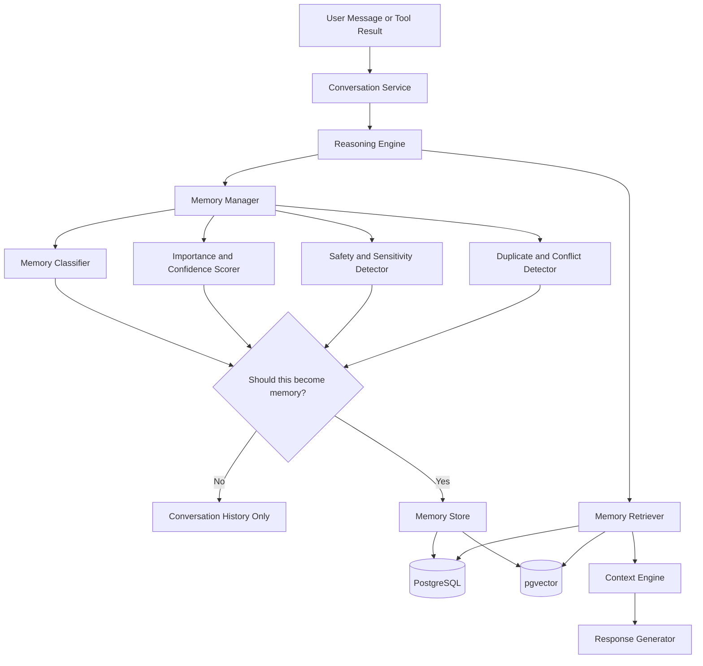
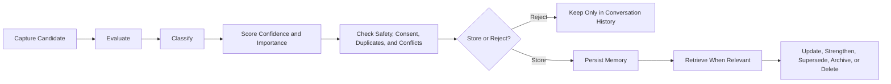
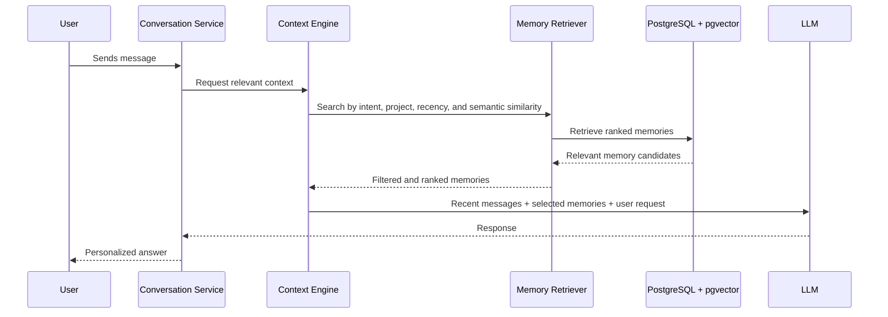

# ADR-001 — Memory Strategy

**Status:** Proposed
**Date:** 2026-07-02
**Decision Owners:** Vishal Singh Kushwaha
**Related Documents:**

* `docs/00-project/north-star.md`
* `docs/00-project/product-constitution.md`
* `docs/00-project/glossary.md`
* `docs/02-architecture/architecture-principles.md`

---

## Context

Raghvi v2 is intended to feel continuous and personal rather than stateless. A user should not need to repeat important preferences, ongoing project details, goals, or prior decisions every time they return.

Traditional chat history alone is insufficient. Raw message logs are noisy, expensive to repeatedly provide to an LLM, difficult to search reliably, and do not distinguish durable facts from temporary conversation.

Raghvi therefore needs a memory system that can preserve useful context over time while remaining transparent, privacy-conscious, editable, and safe.

Memory is also a dependency for future capabilities such as project continuity, personalized responses, daily briefings, reminders, and proactive assistance.

---

## Problem Statement

How should Raghvi store, retrieve, update, and forget user-related information so that it can provide useful continuity without becoming intrusive, inaccurate, opaque, or unsafe?

The solution must support the MVP while leaving a clear path for future capabilities such as habit learning, relationship memory, calendar-aware reminders, and proactive intelligence.

---

## Decision Drivers

The selected approach must prioritize:

* Useful continuity across conversations
* User visibility and control over saved memories
* Privacy and data minimization
* Clear separation between raw chat history and durable memory
* Low operational complexity for a modular monolith
* Efficient retrieval for AI responses
* Ability to update, supersede, archive, or delete outdated memories
* A safe foundation for future proactive assistance
* Strong portfolio-quality architecture that can be explained and defended

---

## Decision

Raghvi v2 will adopt a **Hybrid Layered Memory Architecture**.

The MVP will support five memory layers:

1. **Working Memory**
2. **Conversation History**
3. **Episodic Memory**
4. **Semantic Memory**
5. **Project Memory**

A dedicated **Memory Manager** will control memory capture, classification, scoring, conflict handling, storage, retrieval, and lifecycle management.

Raghvi will use **PostgreSQL with pgvector** as the initial memory store. PostgreSQL will hold structured memory records and metadata, while pgvector will support semantic similarity retrieval.

The MVP will not automatically save every statement. Memory capture will be selective and governed by confidence, importance, sensitivity, duplication, and user-control rules.

---

## Memory Layers

### 1. Working Memory

Working memory is temporary context used to complete the current conversation or task.

Examples:

* The user’s latest request
* The current plan being discussed
* The last few relevant messages
* Temporary tool results

Working memory is not intended to become durable memory automatically.

### 2. Conversation History

Conversation history is the stored sequence of messages exchanged between the user and Raghvi.

It supports traceability, recent context, debugging, and summarization. It is not treated as long-term memory by default.

### 3. Episodic Memory

Episodic memory stores meaningful events, milestones, and summarized interactions.

Examples:

* “On July 2, 2026, the user approved the memory strategy for Raghvi v2.”
* “The user completed the initial repository documentation.”
* “The user decided to use a modular monolith architecture.”

Episodic memory is useful for continuity and project progress.

### 4. Semantic Memory

Semantic memory stores stable facts, preferences, goals, and user knowledge that remain useful across conversations.

Examples:

* “The user prefers structured engineering guidance.”
* “The user is building Raghvi v2 as a portfolio project.”
* “The user prefers step-by-step implementation.”

Semantic memory must be updateable because preferences and facts can change.

### 5. Project Memory

Project memory stores information related to an ongoing user project.

Examples:

* Project name
* Current milestone
* Accepted architecture decisions
* Pending tasks
* Technology choices
* Open questions
* Sprint progress

Project memory is a first-class memory type because continuity across long-running projects is one of Raghvi’s core product advantages.

---

## Memory Architecture Diagram



---

## Memory Lifecycle

Every durable memory follows a controlled lifecycle.



### Lifecycle Rules

* A memory candidate is extracted from a user statement, a confirmed tool result, or a user-approved integration.
* The Memory Manager determines whether the candidate is durable enough to save.
* Each stored memory receives metadata including type, confidence, importance, source, timestamps, and lifecycle status.
* Memories can be updated when new information supersedes older information.
* Low-value, expired, duplicate, or incorrect memories can be archived or deleted.
* Users can manually edit, delete, pin, or export memories.

---

## Memory Retrieval Flow

Raghvi must retrieve only relevant memories instead of loading all user data into every request.



---

## Memory Record Model

Each memory should contain structured metadata.

```yaml
id: mem_001
user_id: user_001
type: semantic
content: "The user prefers structured, production-oriented engineering guidance."
confidence: 0.95
importance: high
source_type: explicit_user_statement
source_reference: conversation_message_id
status: active
created_at: 2026-07-02T00:00:00Z
updated_at: 2026-07-02T00:00:00Z
last_used_at: null
expires_at: null
tags:
  - communication-style
  - engineering
embedding_reference: vector_id
```

The final database schema will be designed after the database strategy ADR, but this model establishes the required concepts.

---

## Memory Capture Policy

### Information That May Be Saved Automatically

Raghvi may automatically save low-risk, useful, and clearly stated information when confidence is high.

Examples:

* Preferred communication style
* Preferred language
* Ongoing project name
* Project decisions
* Explicit goals
* Technology preferences
* Repeated workflow preferences

### Information That Requires Explicit Confirmation

Raghvi must ask before saving information that is personal, sensitive, or likely to cause discomfort if retained.

Examples:

* Relationship information
* Personal secrets
* Financial habits
* Health-related information
* Sensitive life events
* Detailed location routines
* Private workplace information

### Information That Must Never Be Stored as Memory

Raghvi must never save the following as ordinary memory:

* Passwords
* OTPs
* API keys
* Private keys
* Banking credentials
* Card numbers
* Government identification numbers
* Authentication tokens
* Recovery codes
* Other secrets or credentials

If such information appears in a conversation, it should be excluded from memory extraction and handled according to security rules.

---

## Memory Confidence and Importance

Every memory will have two separate scores.

### Confidence

Confidence represents how likely a memory is to be accurate.

High-confidence examples:

* The user explicitly states a preference.
* The user confirms a fact.
* A trusted user-authorized integration provides the information.

Lower-confidence examples:

* The system infers a preference from one message.
* The user expresses uncertainty.
* The information may be temporary.

### Importance

Importance represents how valuable a memory is likely to be in the future.

High-importance examples:

* Long-term goals
* Project architecture decisions
* User communication preferences
* Important deadlines explicitly marked by the user

Low-importance examples:

* One-time casual remarks
* Temporary interests
* Minor details with no future usefulness

A memory may be high-confidence but low-importance, or low-confidence but potentially high-importance. The Memory Manager must evaluate both independently.

---

## Conflict Resolution Policy

Memories can become outdated or contradictory.

Example:

* Existing memory: “The user prefers Java for Android development.”
* New memory: “The user has switched to Kotlin for Android development.”

The MVP policy is:

1. Preserve the previous memory for auditability.
2. Mark the old memory as superseded rather than deleting it immediately.
3. Create or update the new active memory.
4. Prefer the newer, higher-confidence memory during retrieval.
5. Ask the user for clarification only when the conflict materially affects the current task and cannot be resolved by recency or context.

This approach avoids silently rewriting user history while keeping current context accurate.

---

## Retention and Forgetting Policy

The MVP will use simple retention rules rather than complex automated forgetting.

| Memory Type                | Default Retention                                                    |
| -------------------------- | -------------------------------------------------------------------- |
| Conversation History       | Retained until user deletes it or account policy requires deletion   |
| Working Memory             | Session-bound or short-lived                                         |
| Episodic Memory            | Retained while relevant; eligible for archival when stale            |
| Semantic Memory            | Retained until updated, deleted, or explicitly expired               |
| Project Memory             | Retained while the project is active; archived after project closure |
| Sensitive Confirmed Memory | Retained only according to explicit user consent                     |

The system must support manual deletion immediately. Automatic pruning will be introduced gradually after usage data shows which memories are valuable and which become noise.

---

## User Controls

Raghvi will follow the User Sovereignty principle.

The MVP must provide at least:

* A way to view saved memories
* A way to edit a memory
* A way to delete a memory
* A way to disable memory entirely
* A way to see why a memory was saved
* A way to control proactive reminders and briefings
* A way to export memory data in a future iteration

A complete visual Memory Dashboard may evolve after the MVP, but user control cannot be postponed.

---

## Alternatives Considered

### Option A — Conversation History Only

**Description:** Store chat messages and provide recent messages to the LLM.

**Advantages:**

* Simple to implement
* Low initial design effort
* Useful for short conversations

**Disadvantages:**

* Poor long-term continuity
* Expensive context growth
* No distinction between durable facts and temporary remarks
* Weak personalization
* Difficult to support proactive assistance
* Hard for users to manage meaningful information

**Decision:** Rejected.

### Option B — Vector Database Only

**Description:** Store all memory as embedded text and retrieve it using semantic similarity search.

**Advantages:**

* Strong semantic retrieval
* Flexible for unstructured text
* Easy to search by meaning

**Disadvantages:**

* Weak structured querying
* Difficult to represent lifecycle, provenance, permissions, and conflict states
* Harder to support user editing and auditability
* Does not naturally model project state or explicit memory types

**Decision:** Rejected as the sole memory model.

### Option C — Knowledge Graph Only

**Description:** Store users, projects, people, tasks, and concepts as graph entities and relationships.

**Advantages:**

* Strong relationship modeling
* Useful for complex connected knowledge
* Good future potential for project and relationship memory

**Disadvantages:**

* High design and operational complexity
* Premature for the MVP
* Requires graph-query expertise
* Does not replace semantic search or structured relational data

**Decision:** Rejected for the MVP. Graph-like relationships may be represented in PostgreSQL initially.

### Option D — Hybrid Layered Memory Architecture

**Description:** Combine structured relational memory, semantic retrieval, lifecycle metadata, and controlled memory types.

**Advantages:**

* Supports personalization and project continuity
* Allows user controls and auditability
* Supports both structured filters and semantic search
* Enables future proactive intelligence
* Fits PostgreSQL and pgvector
* Evolves cleanly toward graph relationships or specialized storage later

**Disadvantages:**

* More implementation work than chat history
* Requires careful extraction and retrieval evaluation
* Requires privacy and memory-quality safeguards
* Needs clear boundaries to avoid memory pollution

**Decision:** Accepted.

---

## Consequences

### Positive Consequences

* Raghvi can maintain continuity across conversations.
* Users can receive more personalized and context-aware help.
* Project work can resume without repeatedly rebuilding context.
* Memory can support future reminders, briefings, and proactive suggestions.
* The architecture supports transparent user controls.
* PostgreSQL and pgvector keep early infrastructure manageable.
* The design provides clear module boundaries for future extraction.

### Negative Consequences

* Memory extraction and retrieval require evaluation and testing.
* Incorrect memories can reduce trust if not handled carefully.
* User controls increase product and UI scope.
* Privacy requirements must be enforced consistently.
* The backend requires background jobs for embeddings and memory processing.
* The system must avoid over-saving unimportant information.

---

## Risks and Mitigations

| Risk                                  | Mitigation                                                                               |
| ------------------------------------- | ---------------------------------------------------------------------------------------- |
| Memory pollution from saving too much | Use importance thresholds, duplicate detection, and selective capture.                   |
| Incorrect inferred memories           | Store provenance and confidence; prefer explicit statements; allow editing and deletion. |
| Outdated memories                     | Use supersession, timestamps, and retrieval ranking based on recency.                    |
| Privacy concerns                      | Use consent rules, sensitive-data exclusions, user controls, and audit logs.             |
| Slow retrieval                        | Use indexed relational filters, pgvector similarity search, and retrieval limits.        |
| Intrusive proactive behavior          | Require opt-in settings, quiet hours, notification controls, and relevance thresholds.   |
| Complex implementation scope          | Build memory in phases, beginning with semantic and project memory.                      |

---

## MVP Scope

The MVP will include:

* Conversation history
* Working memory for active conversations
* Semantic memory for preferences and stable user facts
* Project memory for Raghvi v2 and user projects
* Episodic summaries for meaningful milestones
* Memory confidence, importance, provenance, and status
* PostgreSQL plus pgvector retrieval
* Manual memory view, edit, and delete controls
* Basic duplicate and conflict handling
* User-enabled project continuation suggestions

The MVP will not include:

* Full relationship memory
* Habit learning
* Autonomous behavioral inference
* Dedicated graph database
* Multi-agent memory sharing
* Advanced memory visualization
* Fully automated memory pruning
* Unrestricted proactive notifications

---

## Future Evolution

Future iterations may add:

* Relationship memory with explicit consent
* Habit memory and routine learning
* Calendar-aware episodic memories
* Knowledge graph visualization
* Dedicated graph storage if relationship queries justify it
* Advanced memory merging and conflict-resolution workflows
* User-configurable retention policies
* Memory quality metrics and evaluation datasets
* Cross-device memory synchronization
* Personalized proactive intelligence with stronger controls

---

## Project Impact

### Backend Modules

This ADR introduces the following planned modules:

```text
memory/
memory_manager/
memory_retriever/
memory_classifier/
memory_embeddings/
memory_api/
```

### Data Model Impact

The final schema will likely include:

```text
memories
memory_embeddings
memory_links
memory_events
memory_audit_logs
```

### API Impact

Likely API capabilities include:

```text
GET    /memories
POST   /memories
PATCH  /memories/{memory_id}
DELETE /memories/{memory_id}
GET    /memories/search
GET    /memories/{memory_id}/provenance
POST   /memories/{memory_id}/confirm
```

### Android Impact

The Android application will require:

* Memory settings
* Basic memory management screen
* Memory deletion and editing flows
* Proactive-assistance preferences
* Permission and consent explanations

---

## Decision Gate

This ADR is approved when the project accepts the following:

* Hybrid layered memory is the foundation of Raghvi’s continuity.
* PostgreSQL with pgvector is the initial storage direction.
* Memory is selective, user-controlled, and auditable.
* Raw chat history is not treated as long-term memory by default.
* Proactive assistance depends on memory but remains opt-in and bounded.
* The MVP begins with working, conversation, episodic, semantic, and project memory.

---

## Interview Talking Points

* Why is chat history not enough for a long-term AI companion?
* Why did you choose a hybrid memory model instead of only a vector database?
* How does Raghvi prevent memory pollution?
* How do users control what Raghvi remembers?
* How are outdated or conflicting memories handled?
* Why use PostgreSQL with pgvector instead of a dedicated vector database initially?
* How does this architecture support proactive assistance safely?
* What would cause you to introduce a graph database or separate memory service later?
