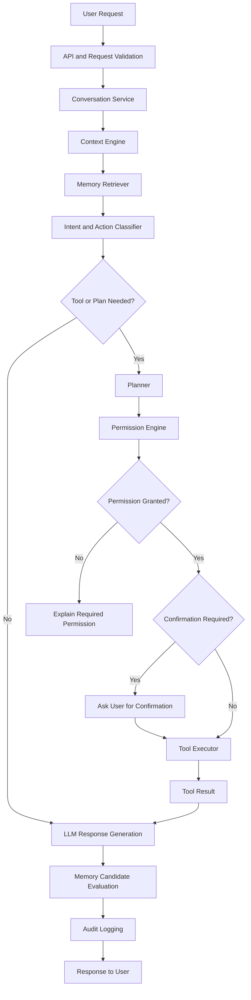

# ADR-002 — AI Orchestration Strategy

**Status:** Proposed
**Date:** 2026-07-02
**Decision Owners:** Vishal Singh Kushwaha
**Related Documents:**

* `docs/03-decisions/ADR-001-memory-strategy.md`
* `docs/00-project/glossary.md`
* `docs/00-project/idea-parking-lot.md`
* `docs/02-architecture/architecture-principles.md`

---

## Context

Raghvi v2 must do more than send a user message directly to an LLM and return text. It needs to assemble context, retrieve relevant memories, decide whether a tool is required, respect permissions, request confirmation for consequential actions, generate a response, and evaluate whether new memory should be saved.

Over time, Raghvi may also need multi-step planning, retries, background execution, approval pauses, durable task state, and multiple tool calls. These needs create an orchestration problem.

The project must choose an orchestration approach that is simple enough for the MVP, but structured enough to evolve into durable agent workflows later.

---

## Problem Statement

How should Raghvi coordinate LLM reasoning, memory retrieval, tool execution, permissions, confirmations, response generation, and memory updates without creating an unmaintainable “AI wrapper” or prematurely introducing unnecessary workflow complexity?

---

## Decision Drivers

The selected approach must prioritize:

* Clear and testable execution flow
* Explicit permission and confirmation boundaries
* Easy debugging and observability
* Low operational complexity for a single-developer modular monolith
* Support for memory-aware responses
* Safe tool execution
* A clean migration path toward durable multi-step workflows
* Provider flexibility for LLMs
* Portfolio-quality architecture that can be explained in interviews

---

## Options Considered

### Option A — Direct LLM Calls

The backend sends user messages directly to an LLM and returns its response.

**Advantages**

* Fastest to build
* Minimal code and infrastructure
* Suitable for simple chat prototypes

**Disadvantages**

* No reliable separation between reasoning, permissions, tools, and memory
* Difficult to test complex behavior
* Easy to create unsafe tool execution paths
* Weak observability
* Does not scale to planning or proactive workflows

**Decision:** Rejected.

---

### Option B — LangChain-Centered Orchestration

Use LangChain abstractions as the primary orchestration layer for prompts, chains, tools, memory, and retrieval.

**Advantages**

* Large ecosystem
* Fast experimentation
* Existing integrations for LLMs, vector stores, and tools
* Familiar patterns for AI application development

**Disadvantages**

* Can obscure important product logic behind framework abstractions
* Framework changes may affect implementation stability
* Raghvi’s permission, memory, and audit rules should remain owned by the application
* May encourage coupling product behavior to library-specific concepts

**Decision:** Not selected as the primary MVP architecture. Individual utilities may be evaluated later, but core orchestration remains application-owned.

---

### Option C — LangGraph from the Start

Use [LangGraph](https://langchain-ai.github.io/langgraph/?utm_source=chatgpt.com) as the central workflow engine from the MVP.

**Advantages**

* Strong support for stateful graphs
* Useful for branching, retries, human approval, pause-and-resume workflows
* Suitable for multi-tool and long-running agent tasks
* Clear future fit for complex task execution

**Disadvantages**

* Adds framework complexity before Raghvi has validated complex workflows
* Requires learning graph state, checkpointing, and framework conventions
* Can make early debugging and architecture ownership harder
* The MVP does not yet require durable multi-step workflows

**Decision:** Deferred to the roadmap.

---

### Option D — Custom Explicit Orchestration Layer

Build a small, application-owned orchestration layer inside the modular monolith. Each stage is explicit, independently testable, and connected through structured request and response objects.

**Advantages**

* Full control over permissions, memory, auditability, and user experience
* Easier to debug and explain
* Keeps the MVP architecture simple
* Supports incremental evolution
* Avoids premature framework lock-in
* Creates a clean boundary for future LangGraph adoption

**Disadvantages**

* Requires building some workflow utilities ourselves
* More initial design work than direct LLM calls
* Complex future workflows may eventually need a dedicated workflow engine

**Decision:** Accepted.

---

## Decision

Raghvi v2 will use a **custom, explicit AI orchestration layer** for the MVP.

The orchestration layer will be application-owned and implemented inside the modular monolith. It will coordinate:

1. Request validation
2. Conversation and session loading
3. Context assembly
4. Memory retrieval
5. Intent and action classification
6. Planning when required
7. Permission checks
8. User confirmation checks
9. Tool execution
10. Response generation
11. Memory candidate evaluation
12. Audit logging

The LLM will be treated as a reasoning and language-generation dependency, not as the owner of application state, permissions, memory policy, or external actions.

LangGraph will be reconsidered when Raghvi has demonstrated a need for durable, branching, multi-step workflows that are difficult to manage through the explicit orchestration layer.

---

## MVP Orchestration Flow



---

## Core Orchestration Components

### Conversation Service

Loads and stores conversation messages, session state, and recent interaction context.

### Context Engine

Builds the minimum relevant context for the current request. It combines recent conversation messages, active project state, selected memories, time-aware information, and approved tool results.

### Memory Retriever

Searches structured and semantic memory using PostgreSQL and pgvector, then returns ranked memory candidates to the Context Engine.

### Intent and Action Classifier

Determines whether the user is asking for information, planning, a tool action, a memory operation, or another supported capability.

This classifier must not grant permissions or execute tools. It only produces a structured recommendation.

### Planner

Breaks complex user goals into smaller steps when needed. The planner may propose a plan, ask clarifying questions, or request approved tools.

The MVP planner remains bounded. It must not autonomously execute high-impact actions.

### Permission Engine

Checks whether Raghvi has the required user-granted permission for a capability or integration.

Examples:

* Can Raghvi access calendar data?
* Can Raghvi create a reminder?
* Can Raghvi open an Android application?
* Can Raghvi draft an email?

### Confirmation Engine

Determines whether a specific action requires explicit approval immediately before execution.

Examples requiring confirmation:

* Sending a message
* Making a call
* Creating or modifying a calendar event
* Deleting user data
* Sharing information externally

### Tool Executor

Invokes approved tools only after permission and confirmation requirements have been satisfied. It validates tool inputs, handles failures, records results, and emits audit events.

### Response Generator

Produces the final natural-language response using the user request, selected context, tool results, and system policies.

### Memory Candidate Evaluator

Sends potentially useful information to the Memory Manager defined in ADR-001. It does not automatically persist every conversation detail.

### Audit Logger

Records important decisions and actions, including permission checks, confirmation events, tool invocations, failures, and memory changes.

---

## Orchestration State Model

The MVP will use a structured request-scoped state object.

```yaml
request_id: req_001
user_id: user_001
conversation_id: conv_001
session_id: session_001

user_message: "Remind me to review ADR-002 tomorrow morning."

intent:
  type: create_reminder
  confidence: 0.97

context:
  recent_messages: []
  memories: []
  active_project: raghvi-v2

plan:
  required: false
  steps: []

permissions:
  reminder_access: granted

confirmation:
  required: false
  status: not_required

tool_calls:
  - tool: create_reminder
    status: pending

audit_events: []
```

The state object must remain serializable and must not contain secrets, raw credentials, or sensitive data that is unnecessary for the request.

---

## Tool Execution Policy

Tools must follow this sequence:

```text
Classify action
→ Validate inputs
→ Check permission
→ Determine confirmation requirement
→ Request confirmation if needed
→ Execute tool
→ Validate result
→ Log audit event
→ Generate response
```

No tool may bypass the Permission Engine or Confirmation Engine.

The LLM may recommend a tool call, but it must not directly invoke device actions or external integrations.

---

## Human-in-the-Loop Rules

Raghvi must preserve user control.

| Action Type              | Permission Required          | Confirmation Required               |
| ------------------------ | ---------------------------- | ----------------------------------- |
| Answer a question        | No                           | No                                  |
| Retrieve saved memory    | Memory enabled               | No                                  |
| Save low-risk preference | Memory enabled               | No                                  |
| Save sensitive memory    | Memory enabled               | Yes                                 |
| Open an Android app      | Device capability enabled    | Usually no                          |
| Create a reminder        | Reminder permission          | No, unless user settings require it |
| Draft a message          | Messaging capability enabled | No                                  |
| Send a message           | Messaging permission         | Yes                                 |
| Make a call              | Calling permission           | Yes                                 |
| Delete data              | Relevant permission          | Yes                                 |
| Modify calendar event    | Calendar permission          | Yes                                 |

These rules are product defaults. Users may configure stricter settings, but Raghvi must never weaken required confirmation for high-impact actions.

---

## Failure Handling

The orchestration layer must fail safely.

| Failure                  | Expected Behavior                                                                    |
| ------------------------ | ------------------------------------------------------------------------------------ |
| LLM provider unavailable | Explain that reasoning is temporarily unavailable; do not execute uncertain actions. |
| Memory retrieval fails   | Continue with limited context and avoid claiming remembered information.             |
| Permission missing       | Explain what permission is needed and why.                                           |
| User denies confirmation | Cancel the action and preserve the conversation context.                             |
| Tool execution fails     | Report the failure clearly; do not claim success.                                    |
| Tool result is ambiguous | Ask the user for clarification or present the result without taking another action.  |
| Request timeout          | Return a safe status and record an audit event.                                      |

---

## Observability Requirements

Every orchestration request should produce structured telemetry.

Minimum fields:

* Request ID
* User ID or privacy-safe internal identifier
* Conversation ID
* Intent classification
* Memory retrieval count and latency
* Selected tool and execution status
* Permission decision
* Confirmation decision
* LLM provider and model identifier
* Total request latency
* Error category
* Audit event references

Sensitive user content must not be copied into logs by default.

---

## LangGraph Adoption Triggers

LangGraph will be evaluated when one or more of the following becomes true:

* A common workflow requires multiple tool calls with branching logic.
* Raghvi needs pause-and-resume behavior across sessions.
* User approvals must suspend a workflow and continue later.
* Retry and compensation logic becomes complex.
* Background tasks need durable workflow state.
* The custom orchestration layer becomes difficult to test or reason about.
* A prototype demonstrates that LangGraph reduces workflow complexity without weakening permission, audit, or memory controls.

If adopted, LangGraph must sit behind Raghvi’s application-owned interfaces. The Permission Engine, Memory Manager, Audit Logger, and user-control rules remain Raghvi-owned domains.

---

## Consequences

### Positive Consequences

* Raghvi’s critical behavior remains explicit and application-owned.
* Permissions and confirmations are enforceable outside the LLM.
* The MVP remains easier to test, debug, and explain.
* The architecture supports incremental adoption of more advanced workflow tooling.
* The system avoids premature dependence on a rapidly evolving AI framework.

### Negative Consequences

* The project must implement and maintain orchestration interfaces.
* Complex workflows may require refactoring later.
* The initial planner will be intentionally limited.
* Some development speed benefits of an agent framework are deferred.

---

## Project Impact

### Planned Backend Modules

```text
ai_orchestration/
conversation/
context/
planning/
permissions/
confirmations/
tools/
tool_execution/
audit/
llm_gateway/
```

### Likely API Capabilities

```text
POST /conversations/{conversation_id}/messages
POST /actions/{action_id}/confirm
GET  /actions/{action_id}
GET  /permissions
PATCH /permissions
GET  /audit-events
```

### Background Jobs

Future background jobs may support:

* Memory extraction and embedding generation
* Scheduled proactive checks
* Reminder processing
* Durable task execution
* Notification delivery
* Workflow recovery

---

## Future Evolution

Potential future additions include:

* LangGraph-backed durable workflows
* Multi-agent coordination for specialized tasks
* Workflow visualization
* Background task queues with retries and compensation
* Graph-aware planning using knowledge relationships
* GraphRAG for relationship-heavy project questions
* Evaluation harnesses for tool-selection and planning quality

---

## Decision Gate

This ADR is approved when the project accepts that:

* The MVP uses a custom explicit orchestration layer.
* The LLM does not own permissions, memory policy, audit logging, or tool execution.
* All external actions pass through permission and confirmation checks.
* The MVP supports bounded planning and optional single-tool execution.
* LangGraph is a roadmap evaluation, not an immediate dependency.
* Future orchestration complexity will be measured before introducing a workflow framework.

---

## Interview Talking Points

* Why did you avoid direct LLM-to-tool execution?
* Why did you choose custom orchestration over LangGraph for the MVP?
* How does Raghvi enforce human approval for consequential actions?
* What happens when the LLM is unavailable or uncertain?
* How do you keep permissions and auditability outside the LLM?
* What signals would justify adopting LangGraph?
* How would you evolve this design into durable multi-step workflows?
