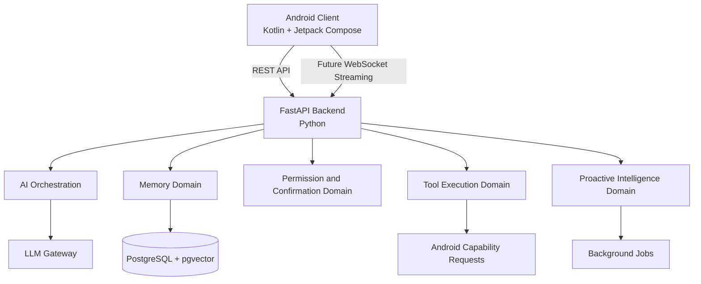

# ADR-003 — Backend Framework and Runtime

**Status:** Accepted
**Date:** 2026-07-02
**Decision Owners:** Vishal Singh Kushwaha
**Related Documents:**

* `docs/03-decisions/ADR-001-memory-strategy.md`
* `docs/03-decisions/ADR-002-ai-orchestration.md`
* `docs/02-architecture/architecture-principles.md`
* `docs/00-project/glossary.md`

---

## Context

Raghvi v2 is an Android-first AI companion with a backend responsible for AI orchestration, long-term memory, retrieval, permissions, tool execution, proactive intelligence, background jobs, and APIs for the mobile client.

The backend must support rapid iteration during early product development while remaining structured, testable, secure, and maintainable as the system grows.

The Android client must support native Android capabilities such as notifications, permissions, app intents, local storage, device integrations, and future voice or background features.

---

## Problem Statement

Which backend runtime and framework should Raghvi use for its AI-heavy application logic, and which Android technology should power the mobile client?

The selected stack must support the MVP efficiently while preserving a clean path toward production-quality architecture.

---

## Decision Drivers

The selected technologies must prioritize:

* Strong support for LLMs, embeddings, RAG, and AI evaluation
* Fast iteration for a single-developer portfolio project
* Clear API contracts between backend and Android
* Native Android capability support
* Async request handling
* Type validation and reliable error handling
* Testability and maintainability
* Compatibility with PostgreSQL, pgvector, Redis, and background jobs
* A practical path toward future LangGraph evaluation
* Professional, explainable architecture choices

---

## Options Considered

### Option A — FastAPI with Python Backend and Kotlin Android Client

Use Python and FastAPI for backend APIs and AI domains. Use Kotlin and Jetpack Compose for the Android application.

**Advantages**

* Strong Python ecosystem for LLM providers, embeddings, RAG, evaluation, and future agent frameworks
* FastAPI provides async support, request validation, OpenAPI documentation, and dependency injection
* Fast development cycle for AI experimentation
* Kotlin provides native Android access and strong support for modern Android development
* Clear separation between AI backend responsibilities and device responsibilities
* Well suited to a modular monolith

**Disadvantages**

* Backend and Android use different languages
* Python provides less compile-time type safety than Kotlin
* Requires disciplined type validation, testing, and module boundaries

**Decision:** Accepted.

---

### Option B — Spring Boot with Kotlin Backend and Kotlin Android Client

Use Kotlin for both backend and Android.

**Advantages**

* One primary language across the stack
* Strong type safety and enterprise conventions
* Mature ecosystem for authentication, APIs, and databases
* Good long-term maintainability for large teams

**Disadvantages**

* Slower iteration for AI-heavy experimentation
* Python AI libraries and examples often require separate integration work
* More framework configuration for an early-stage project
* May encourage premature enterprise complexity

**Decision:** Rejected for the MVP.

---

### Option C — NestJS with TypeScript Backend and React Native Client

Use TypeScript for backend APIs and a cross-platform mobile client.

**Advantages**

* Shared language across backend and frontend
* Strong developer tooling
* Structured backend patterns
* Potential future web-client reuse

**Disadvantages**

* Less direct access to Python-first AI tooling
* Android device integration may require more native bridge work
* Cross-platform development is not necessary for an Android-first MVP
* Adds complexity without improving the core AI and memory architecture

**Decision:** Rejected for the MVP.

---

### Option D — Django with Python Backend and Kotlin Android Client

Use Django and Django REST Framework for backend APIs.

**Advantages**

* Mature Python web ecosystem
* Built-in admin capabilities
* Strong conventions for data-heavy applications
* Good authentication and ORM support

**Disadvantages**

* Less natural fit for async AI orchestration and streaming responses
* More framework features than the MVP currently needs
* FastAPI is more direct for API-first, AI-heavy backend services

**Decision:** Rejected for the MVP.

---

## Decision

Raghvi v2 will use:

* **Backend runtime:** Python
* **Backend framework:** FastAPI
* **Android language:** Kotlin
* **Android UI framework:** Jetpack Compose
* **Backend-to-client communication:** REST APIs initially, with WebSocket support introduced for streaming or real-time features when needed

The backend will remain a modular monolith. It will expose application-owned APIs to the Android client and will own AI orchestration, memory, permissions, tool execution, and persistence.

The Android client will own user interaction, device permissions, notifications, local presentation state, and Android-specific actions.

---

## High-Level Runtime Architecture



---

## Responsibility Boundaries

### FastAPI Backend Responsibilities

The backend will own:

* User and session APIs
* Conversation APIs
* AI orchestration
* Context assembly
* Memory capture, retrieval, updates, and deletion
* LLM provider integration through an LLM Gateway
* Tool-selection logic
* Permission and confirmation policies
* Audit logging
* Background-job coordination
* Proactive intelligence logic
* Database access and persistence
* API validation and error responses

### Android Client Responsibilities

The Android application will own:

* Chat interface
* Memory-management screens
* Permission prompts and settings navigation
* Notifications and local notification display
* Android app intents
* User confirmation screens
* Local UI state
* Secure local token storage
* Device-specific capability execution after backend authorization
* Network communication with the FastAPI backend

The Android client must not independently decide whether an action is permitted. It may execute an approved device action only after receiving a valid backend instruction and verifying that required Android permissions are available.

---

## API Strategy

The MVP will use REST APIs for predictable request-response operations.

Examples:

```text
POST   /auth/login
POST   /conversations
POST   /conversations/{conversation_id}/messages
GET    /conversations/{conversation_id}
GET    /memories
PATCH  /memories/{memory_id}
DELETE /memories/{memory_id}
GET    /permissions
PATCH  /permissions
POST   /actions/{action_id}/confirm
GET    /briefings/today
```

WebSockets will be evaluated for:

* Streaming LLM responses
* Real-time tool-progress updates
* Long-running task status
* Proactive notification synchronization

REST remains the default MVP API style because it is easier to test, document, secure, and consume from Android.

---

## FastAPI Application Structure

The backend will use domain-oriented modules rather than a single large routes folder.

```text
backend/
├── app/
│   ├── main.py
│   ├── core/
│   │   ├── config.py
│   │   ├── security.py
│   │   ├── logging.py
│   │   └── exceptions.py
│   │
│   ├── api/
│   │   ├── router.py
│   │   └── dependencies.py
│   │
│   ├── modules/
│   │   ├── auth/
│   │   ├── users/
│   │   ├── conversation/
│   │   ├── memory/
│   │   ├── ai_orchestration/
│   │   ├── context/
│   │   ├── planning/
│   │   ├── permissions/
│   │   ├── confirmations/
│   │   ├── tools/
│   │   ├── audit/
│   │   └── proactive_intelligence/
│   │
│   ├── infrastructure/
│   │   ├── database/
│   │   ├── llm/
│   │   ├── cache/
│   │   ├── queue/
│   │   └── integrations/
│   │
│   └── shared/
│       ├── schemas/
│       ├── utils/
│       └── types/
│
├── tests/
├── alembic/
├── pyproject.toml
└── README.md
```

This structure is a starting point. Modules must expose clear interfaces and avoid directly reaching into each other’s internal persistence or business logic.

---

## Validation and Type Strategy

FastAPI will use Pydantic models for:

* API request validation
* API response contracts
* Configuration validation
* Structured orchestration state
* Tool input and output validation
* Background-job payload validation

The backend will use Python type hints throughout application code.

The project should adopt:

* Pydantic for runtime validation
* Ruff for linting and formatting
* Pyright or mypy for static type checking
* Pytest for automated testing
* Alembic for database migrations

---

## Dependency Management

The backend will use `pyproject.toml` as the dependency-management source of truth.

The initial approach will use a modern Python package manager such as `uv` or Poetry. The final package-manager choice will be documented in the repository setup guide.

Dependency rules:

* Pin or constrain production dependencies.
* Keep AI-provider SDKs behind the LLM Gateway.
* Avoid adding frameworks before a concrete requirement exists.
* Separate production, development, and test dependencies.
* Review dependency updates regularly.
* Never commit secrets or provider keys to the repository.

---

## LLM Provider Boundary

The backend will not tightly couple business logic to one LLM provider.

An application-owned LLM Gateway will provide a stable interface for:

* Chat completion
* Structured output generation
* Embedding generation
* Streaming responses
* Model selection
* Provider fallback in the future
* Usage and latency tracking

Example conceptual interface:

```text
LLMGateway
  ├── generate_response(...)
  ├── generate_structured_output(...)
  ├── create_embedding(...)
  └── stream_response(...)
```

This allows Raghvi to evaluate providers such as [Anthropic Claude](https://www.anthropic.com/?utm_source=chatgpt.com), [OpenAI](https://openai.com/?utm_source=chatgpt.com), or other compatible models without rewriting orchestration or memory logic.

---

## Android Technology Direction

The Android client will use:

* Kotlin
* Jetpack Compose
* Android Architecture Components
* ViewModel-based presentation logic
* Repository pattern for data access
* Retrofit or an equivalent HTTP client
* Kotlin Coroutines and Flow for asynchronous work
* Android permission APIs
* WorkManager for appropriate local background work
* Room only when offline or local caching requirements justify it

The client should follow a feature-oriented package structure.

```text
android/
├── app/
├── core/
│   ├── network/
│   ├── ui/
│   ├── design_system/
│   ├── permissions/
│   └── common/
│
├── feature/
│   ├── chat/
│   ├── memory/
│   ├── briefing/
│   ├── settings/
│   ├── permissions/
│   └── onboarding/
│
└── data/
    ├── remote/
    ├── local/
    └── repository/
```

---

## Consequences

### Positive Consequences

* Python provides strong support for AI, RAG, embeddings, and future workflow experimentation.
* FastAPI supports fast API development with validation and documentation.
* Kotlin and Jetpack Compose provide native Android capability access.
* The backend and Android client have clean responsibility boundaries.
* The architecture supports independent evolution of mobile and backend code.
* The LLM Gateway reduces provider lock-in.
* The stack is practical for a portfolio project and explainable in interviews.

### Negative Consequences

* The project uses two primary languages.
* Python requires discipline around typing, testing, and boundaries.
* Android and backend development require separate build and test workflows.
* WebSocket streaming and background processing add complexity when introduced.
* FastAPI alone does not solve authentication, job queues, observability, or deployment; those require later ADRs.

---

## Risks and Mitigations

| Risk                                                        | Mitigation                                                                              |
| ----------------------------------------------------------- | --------------------------------------------------------------------------------------- |
| Python code becomes loosely structured                      | Enforce module boundaries, type checking, linting, tests, and code review discipline.   |
| LLM provider lock-in                                        | Use the application-owned LLM Gateway.                                                  |
| Android client becomes tightly coupled to backend internals | Maintain stable versioned API contracts and DTOs.                                       |
| AI response latency affects user experience                 | Add streaming later, use background jobs for slow tasks, and track latency metrics.     |
| Too many dependencies early                                 | Add dependencies only through documented decisions and concrete requirements.           |
| Device actions are executed unsafely                        | Keep authorization logic in the backend and require Android-side permission validation. |

---

## MVP Scope

The MVP will include:

* Python FastAPI backend
* Kotlin and Jetpack Compose Android client
* REST APIs for core operations
* Pydantic request and response validation
* PostgreSQL integration
* LLM Gateway abstraction
* Domain-oriented backend modules
* Android chat, memory, settings, and permission flows
* Basic automated tests and linting

The MVP will not require:

* Web client
* iOS client
* Full offline-first synchronization
* WebSocket streaming at launch
* Multi-region deployment
* Kubernetes
* Microservices
* LangGraph as a runtime dependency

---

## Future Evolution

Future iterations may add:

* WebSocket streaming for chat responses
* Server-sent events where appropriate
* Offline caching and synchronization
* A web or desktop client
* LangGraph behind the orchestration boundary
* Provider fallback and model routing
* Dedicated worker processes for background tasks
* API versioning and public developer APIs
* Extraction of modules into services if measurable scaling needs emerge

---

## Decision Gate

This ADR is accepted when the project agrees that:

* FastAPI and Python are the backend foundation.
* Kotlin and Jetpack Compose are the Android-client foundation.
* REST is the initial API style.
* AI providers are accessed only through an LLM Gateway.
* The backend remains a modular monolith.
* The Android client owns presentation and device integration, while the backend owns policy and AI logic.
* WebSockets, LangGraph, microservices, and advanced deployment are deferred until justified.

---

## Interview Talking Points

* Why did you choose Python and FastAPI for an AI assistant backend?
* Why use Kotlin and Jetpack Compose instead of React Native or Flutter?
* How do you avoid LLM provider lock-in?
* Why is REST the initial API style instead of WebSockets?
* How do you maintain quality and type safety in Python?
* Why is a modular monolith appropriate for this stage?
* How are device permissions and backend authorization separated?
