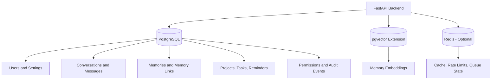
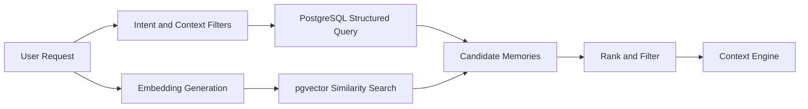

# ADR-004 — Data Storage and Retrieval Strategy

**Status:** Accepted
**Date:** 2026-07-02
**Decision Owners:** Vishal Singh Kushwaha
**Related Documents:**

* `docs/03-decisions/ADR-001-memory-strategy.md`
* `docs/03-decisions/ADR-002-ai-orchestration.md`
* `docs/03-decisions/ADR-003-backend-framework-and-runtime.md`
* `docs/02-architecture/architecture-principles.md`

---

## Context

Raghvi v2 needs to store several kinds of data with very different access patterns:

* User accounts and settings
* Conversations and messages
* Durable memories
* Projects, tasks, decisions, and reminders
* Permissions and confirmations
* Audit events
* Semantic embeddings for memory retrieval
* Temporary caches and background-job state

The system must support reliable transactional data, semantic retrieval, structured filtering, lifecycle management, auditability, and future graph-aware intelligence without introducing unnecessary infrastructure during the MVP.

---

## Problem Statement

How should Raghvi store and retrieve transactional application data, long-term memory, vector embeddings, temporary cache data, and background-job state while keeping the MVP architecture simple and scalable?

---

## Decision Drivers

The storage strategy must prioritize:

* One reliable source of truth for core user data
* Strong support for structured queries and transactions
* Semantic memory retrieval
* Clear memory lifecycle and auditability
* Low operational complexity
* Compatibility with Python and FastAPI
* Easy local development and deployment
* A migration path toward graph-aware retrieval
* Separation between durable data and temporary state
* Strong privacy and deletion controls

---

## Decision

Raghvi v2 will use:

* **PostgreSQL** as the primary transactional database and source of truth.
* **pgvector** inside PostgreSQL for vector embeddings and semantic similarity search.
* **Alembic** for database migrations.
* **Redis** only when caching, rate limiting, queues, or ephemeral workflow state becomes necessary.
* **PostgreSQL relationship tables** for graph-like links during the MVP.
* A dedicated vector database, graph database, or search engine only when measurable product or scale requirements justify it.

The initial system will avoid operating multiple databases unless each has a clear and validated responsibility.

---

## Storage Responsibilities

| Storage Need                 | Initial Technology                          | Purpose                                       |
| ---------------------------- | ------------------------------------------- | --------------------------------------------- |
| Users, settings, permissions | PostgreSQL                                  | Durable transactional application data        |
| Conversations and messages   | PostgreSQL                                  | Conversation continuity and traceability      |
| Memories and metadata        | PostgreSQL                                  | Structured memory lifecycle and user controls |
| Embeddings                   | PostgreSQL + pgvector                       | Semantic similarity retrieval                 |
| Projects, tasks, reminders   | PostgreSQL                                  | Structured project and productivity data      |
| Audit events                 | PostgreSQL                                  | Action history and accountability             |
| Relationship links           | PostgreSQL                                  | Graph-like connections between records        |
| Cache and rate limits        | Redis, when needed                          | Temporary and high-speed state                |
| Background-job queue state   | Redis or database-backed queue, when needed | Asynchronous work coordination                |

---

## High-Level Data Architecture



---

## PostgreSQL as the Source of Truth

PostgreSQL will store all durable application data that must be reliable, queryable, editable, exportable, or auditable.

This includes:

* User profiles
* User preferences
* Conversations
* Messages
* Memories
* Memory metadata
* Memory provenance
* Project records
* Tasks
* Reminders
* Permission grants
* Confirmation events
* Tool execution records
* Audit logs
* Relationship links

PostgreSQL is selected because it provides transactions, constraints, indexing, relational querying, mature tooling, backups, migrations, and a strong fit for the modular monolith.

---

## pgvector for Semantic Retrieval

Raghvi will use pgvector to store embeddings alongside structured memory records.

This supports hybrid retrieval:

```text
Structured filters
+ semantic similarity search
+ recency
+ importance
+ confidence
= ranked context
```

Example retrieval flow:



The system must not rely only on vector similarity. Memory retrieval should also consider:

* User identity
* Active project
* Memory type
* Status
* Recency
* Importance
* Confidence
* Explicit user pins
* Privacy and consent restrictions

---

## Initial Core Data Model

The final schema will evolve, but the MVP is expected to include the following tables.

```text
users
user_settings
conversations
messages

memories
memory_embeddings
memory_links
memory_events
memory_audit_logs

projects
project_members
tasks
reminders

permissions
confirmation_requests
tool_executions
audit_events
```

### Key Relationship Principles

* Every user-owned record must include a user identifier.
* Durable records must include creation and update timestamps.
* Sensitive operations must create audit events.
* Memory records must include provenance, confidence, importance, and status.
* Deleted user data should be handled through explicit deletion workflows, not hidden soft-deletion alone.
* Relationship links must be explicit rather than inferred silently.

---

## Memory and Embedding Model

A memory record represents the structured meaning and lifecycle state of a memory.

An embedding record represents the vector representation used for semantic retrieval.

```text
memories
  ├── id
  ├── user_id
  ├── type
  ├── content
  ├── confidence
  ├── importance
  ├── status
  ├── source_type
  ├── source_reference
  ├── created_at
  ├── updated_at
  └── expires_at

memory_embeddings
  ├── id
  ├── memory_id
  ├── embedding_model
  ├── embedding_vector
  ├── created_at
  └── updated_at
```

Embeddings must be regenerated when the memory content materially changes or when the project intentionally migrates to a new embedding model.

---

## Relationship Modeling and Future Graph Readiness

The MVP will represent relationships through relational link tables.

Example:

```text
memory_links
  ├── id
  ├── user_id
  ├── source_memory_id
  ├── target_memory_id
  ├── relationship_type
  ├── confidence
  ├── source
  └── created_at
```

Potential relationship types include:

* related_to
* belongs_to_project
* blocks
* depends_on
* supersedes
* supports_goal
* references_decision
* associated_with_person
* scheduled_for

This allows Raghvi to support selected relationship-aware queries without introducing a dedicated graph database.

A dedicated knowledge graph or GraphRAG architecture will be evaluated only when relational links and PostgreSQL traversal become a measurable limitation.

---

## Redis Policy

Redis is not required on day one.

It will be introduced only for a specific validated need, such as:

* API rate limiting
* Short-lived response caching
* Distributed locks
* Background-job queues
* Temporary workflow state
* WebSocket connection coordination
* Notification deduplication

Redis must not become the source of truth for user data, memory, permissions, or audit records.

If Redis becomes unavailable, the system should degrade safely rather than losing durable user information.

---

## Migration Strategy

All schema changes must be managed through Alembic migrations.

Rules:

* Never manually alter production schema without a migration.
* Every migration must be reviewed and tested locally.
* Migrations must be reversible where practical.
* Destructive migrations require backup and rollback planning.
* Seed data must be separate from schema migrations.
* Migration history must be committed to Git.

Example workflow:

```text
Change SQLAlchemy model
→ Generate migration
→ Review generated migration
→ Test locally
→ Run automated tests
→ Commit migration with code
```

---

## Indexing Strategy

The MVP will add indexes based on expected query patterns, not speculation.

Likely early indexes include:

* `user_id` on all user-owned records
* `conversation_id` and timestamp on messages
* `project_id` and status on tasks
* memory type, status, and user identifier
* reminder schedule and completion status
* audit-event timestamps
* pgvector index for embedding similarity search when data volume justifies it

Indexes must be measured and reviewed because unnecessary indexes increase write cost and migration complexity.

---

## Data Retention and Deletion

Raghvi must support user control over durable data.

The MVP must support:

* Deleting individual memories
* Deleting conversations
* Disabling memory capture
* Deleting project records
* Removing permission grants
* Deleting account-associated data through a defined workflow

Deletion must include related embeddings and relevant derived records where appropriate.

Audit requirements may require retaining limited non-content operational metadata, but this must be documented clearly and must not override user privacy without a valid policy basis.

---

## Backup and Recovery Direction

For development, local database backups are sufficient.

For production, the project will require:

* Automated PostgreSQL backups
* Tested restore procedures
* Encryption in transit
* Encryption at rest where supported by the hosting provider
* Access controls for database credentials
* Monitoring for failed backups
* A documented recovery objective before public release

Backup and deployment implementation details will be finalized in a future infrastructure ADR.

---

## Alternatives Considered

### Option A — PostgreSQL Only, Without Vector Search

**Advantages**

* Simplest infrastructure
* Strong transactional support
* Easy structured querying

**Disadvantages**

* Weak semantic retrieval
* Poor fit for memory search by meaning
* Would require manual keyword-based retrieval

**Decision:** Rejected.

### Option B — PostgreSQL + pgvector

**Advantages**

* One primary database
* Structured and semantic retrieval in one system
* Lower operational overhead
* Strong fit for memory metadata and user controls
* Easy integration with FastAPI and Python

**Disadvantages**

* May not match dedicated vector databases at very large scale
* Requires careful index tuning as data grows

**Decision:** Accepted.

### Option C — Dedicated Vector Database from the Start

**Advantages**

* Purpose-built vector search
* May offer advanced retrieval features
* Potentially easier scaling for very large embedding collections

**Disadvantages**

* Adds another operational system
* Requires synchronization with transactional data
* Makes deletion, auditing, and consistency more complex
* Not justified for MVP data volume

**Decision:** Deferred.

### Option D — Dedicated Graph Database from the Start

**Advantages**

* Strong multi-hop relationship queries
* Natural graph modeling
* Useful for future GraphRAG

**Disadvantages**

* Adds a new data model and operational burden
* Requires graph-query expertise
* Premature before relationship-heavy queries are validated
* Increases synchronization complexity

**Decision:** Deferred.

---

## Consequences

### Positive Consequences

* One durable source of truth simplifies development and debugging.
* pgvector enables semantic memory retrieval without separate vector infrastructure.
* Structured metadata improves memory quality and user controls.
* Relational links provide a practical bridge toward graph-aware intelligence.
* Alembic makes schema evolution controlled and reviewable.
* Redis remains optional rather than becoming premature infrastructure.

### Negative Consequences

* PostgreSQL must handle both transactional and vector workloads.
* Retrieval quality depends on good embedding, ranking, and filtering logic.
* Large-scale semantic search may require future architecture changes.
* Relationship-heavy queries may eventually justify graph storage.
* Data deletion workflows require careful cascading and audit design.

---

## MVP Scope

The MVP will include:

* PostgreSQL database
* pgvector extension
* Alembic migrations
* Core transactional tables
* Memory and embedding tables
* Structured memory links
* Basic indexing
* User-owned data boundaries
* Memory deletion support
* Audit-event persistence

The MVP will not include:

* Dedicated vector database
* Dedicated graph database
* GraphRAG runtime
* Elasticsearch or OpenSearch
* Data warehouse
* Multi-region replication
* Complex cache topology
* Redis unless a concrete need appears

---

## Future Evolution

Future iterations may add:

* Redis for caching and queue coordination
* Read replicas for PostgreSQL
* Dedicated vector search if semantic workload requires it
* Knowledge graph storage for relationship-heavy queries
* GraphRAG for validated multi-hop reasoning use cases
* Search engine integration for large document collections
* Data retention configuration per user
* Encrypted field-level storage for selected sensitive data
* Analytics pipeline with privacy-preserving aggregation

---

## Decision Gate

This ADR is accepted when the project agrees that:

* PostgreSQL is the primary source of truth.
* pgvector is the initial semantic retrieval solution.
* Alembic manages all schema changes.
* Redis is optional and introduced only for validated needs.
* Relational links are sufficient for initial graph-like relationships.
* Dedicated vector and graph databases are deferred until evidence justifies them.
* User data, memory lifecycle, and deletion controls remain first-class requirements.

---

## Interview Talking Points

* Why use PostgreSQL with pgvector instead of a separate vector database?
* How do you combine structured filtering with semantic retrieval?
* Why is PostgreSQL the source of truth for memory?
* How will Raghvi handle outdated embeddings?
* Why defer Redis and a graph database?
* How do relational links prepare the system for GraphRAG?
* How do migrations protect production data?
* How would this architecture evolve at larger scale?
