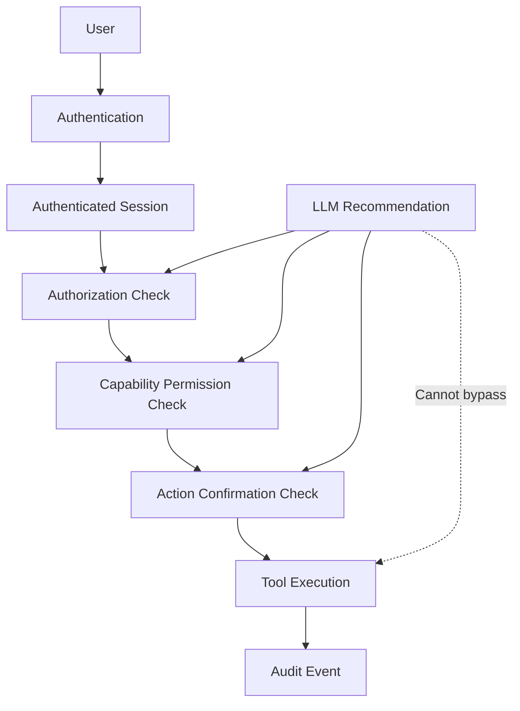

# ADR-005 — Authentication, Authorization, Permissions, and Privacy Boundaries

**Status:** Accepted
**Date:** 2026-07-02
**Decision Owners:** Vishal Singh Kushwaha
**Related Documents:**

* `docs/03-decisions/ADR-001-memory-strategy.md`
* `docs/03-decisions/ADR-002-ai-orchestration.md`
* `docs/03-decisions/ADR-003-backend-framework-and-runtime.md`
* `docs/03-decisions/ADR-004-data-storage-and-retrieval.md`

---

## Context

Raghvi v2 will store user conversations, memories, project information, preferences, permissions, reminders, and audit records. Future versions may connect to device capabilities, calendars, email, messaging, and other external services.

Because Raghvi is designed to feel personal and proactive, users must be able to trust that their information is protected, that actions happen only with their approval, and that permissions can be reviewed or revoked at any time.

Authentication, authorization, device permissions, and privacy controls must be designed as separate concerns. An authenticated user is not automatically allowed to perform every action, and an LLM recommendation is not permission to access data or execute a tool.

---

## Problem Statement

How should Raghvi authenticate users, authorize access to user-owned data, manage device and integration permissions, require confirmation for consequential actions, and protect privacy without creating unnecessary complexity in the MVP?

---

## Decision Drivers

The solution must prioritize:

* Strong user-data isolation
* Clear separation between identity, authorization, permission, and confirmation
* Secure Android authentication flow
* Revocable access to device and external capabilities
* Privacy-first memory handling
* Auditability for sensitive actions
* Low implementation complexity for the MVP
* A clean path toward social login and external integrations
* No dependence on the LLM for security decisions

---

## Decision

Raghvi v2 will use a layered security model:

1. **Authentication** verifies who the user is.
2. **Authorization** verifies what data and resources that user may access.
3. **Capability permission** verifies whether Raghvi may use a device or external integration.
4. **Action confirmation** verifies whether the user approves a specific consequential action now.
5. **Audit logging** records important security and action events.

The MVP will support email-and-password authentication with secure token-based sessions. Authentication and user identity will be owned by the backend.

The Android client will store session tokens only in Android secure storage. The backend will enforce ownership checks for every user-owned resource.

The LLM must never make final security decisions. It may suggest an action, but authorization, permissions, confirmations, and tool execution must be enforced by application code.

---

## Security Boundary Model



---

## Definitions

### Authentication

Authentication establishes the identity of the user.

Example: a user logs in using email and password and receives an authenticated session.

### Authorization

Authorization determines whether the authenticated user can access a specific resource or perform an internal operation.

Example: a user can access only their own conversations, memories, projects, and audit records.

### Capability Permission

Capability permission determines whether Raghvi is allowed to access a device capability or external service.

Examples:

* Notification permission
* Calendar access
* Android app-launch capability
* Contact access
* Email integration access

### Action Confirmation

Action confirmation is an immediate approval for a specific consequential action.

Examples:

* “Send this message to Rahul?”
* “Call Mom now?”
* “Delete this memory permanently?”
* “Create this calendar event?”

A granted capability permission does not remove the need for confirmation when confirmation is required.

---

## Authentication Strategy

The MVP will use backend-managed authentication with:

* Email and password registration
* Email and password login
* Password hashing using a modern password-hashing algorithm
* Short-lived access tokens
* Refresh tokens with rotation or revocation support
* Logout and session invalidation
* Password-reset flow before public release
* Rate limiting for authentication endpoints when Redis or an equivalent mechanism is introduced

The exact identity-provider implementation may be application-owned initially or delegated to a managed provider later. The API and domain boundaries must allow either approach.

---

## Token and Session Policy

The Android client will use token-based authentication.

```text
Login
→ Backend validates credentials
→ Backend issues short-lived access token
→ Backend issues refresh token
→ Android stores tokens in secure storage
→ Android sends access token with API requests
→ Backend validates token and user identity
```

Rules:

* Access tokens must be short-lived.
* Refresh tokens must be revocable.
* Tokens must never be logged.
* Tokens must never be stored in plain text.
* Tokens must not be included in URLs.
* Logout must invalidate the active refresh token or session.
* A user must be able to revoke sessions in a future account-security screen.

---

## Android Secure Storage Policy

The Android client must use Android-supported secure storage mechanisms for authentication tokens and sensitive local values.

The client must not store tokens in:

* Plain SharedPreferences
* Source code
* Log files
* Screenshots
* Clipboard by default
* Unencrypted local files

The client should clear local session data when the user logs out or when the backend invalidates the session.

---

## Authorization Model

The MVP will use a resource-ownership authorization model.

Every user-owned resource must be scoped by `user_id`.

Examples:

```text
GET /memories/{memory_id}
→ Verify memory.user_id == authenticated_user.id

PATCH /projects/{project_id}
→ Verify project.owner_id == authenticated_user.id

GET /conversations/{conversation_id}
→ Verify conversation.user_id == authenticated_user.id
```

The backend must not trust user identifiers sent in request bodies when the authenticated session already establishes identity.

The authenticated user identity must come from the verified access token or server-side session context.

---

## Future Role Model

The MVP assumes one primary user role:

```text
user
```

Future roles may include:

```text
admin
support_operator
developer
family_member
team_member
```

No future role may bypass user privacy or access private memory without a clearly documented consent and authorization model.

Administrative access must be minimal, audited, and separated from normal application flows.

---

## Permission Model

Permissions are stored as explicit user-controlled capability grants.

Example permission states:

```text
not_requested
granted
denied
revoked
unavailable
```

Example permission categories:

```text
memory_enabled
notifications
calendar_read
calendar_write
contacts_read
app_launch
microphone
location
email_integration
messaging_integration
```

Permission records must include:

* User identifier
* Permission type
* Current state
* Source of grant
* Grant timestamp
* Revocation timestamp when applicable
* Last-use timestamp where useful
* Scope or integration identifier when applicable

---

## Permission Principles

Raghvi will follow these principles:

* Ask for permissions only when a feature requires them.
* Explain why a permission is needed before requesting it.
* Do not request broad access for hypothetical future features.
* Treat denied permissions as valid user choices.
* Provide a clear way to revoke permissions.
* Do not repeatedly pressure users after denial.
* Do not infer permission from conversation text.
* Re-check permission before each protected action.
* Separate Android operating-system permission from backend policy permission.

---

## Confirmation Policy

Confirmation is required for actions that are external, irreversible, sensitive, financially consequential, or likely to affect another person.

Examples requiring confirmation:

* Sending a message
* Making a phone call
* Sending an email
* Creating, modifying, or deleting a calendar event
* Deleting memories, conversations, projects, or files
* Sharing user information externally
* Changing security settings
* Connecting a new third-party integration

Examples that generally do not require a second confirmation after a direct user request:

* Answering a question
* Drafting a message
* Creating an internal plan
* Saving a low-risk preference
* Opening an explicitly requested app
* Creating a reminder explicitly requested in the current interaction

Confirmation requests must be explicit, understandable, and tied to a specific action payload.

```text
Action: Send WhatsApp message
Recipient: Rahul
Message: “I will call you after 6 PM.”
Result: Awaiting user confirmation
```

---

## Privacy Boundaries

Raghvi will use privacy-by-design principles.

### Data Minimization

Raghvi should store only information necessary to provide the requested capability or a clearly explained personalized experience.

### Purpose Limitation

User data must be used only for the purpose for which it was collected or for a clearly compatible user-approved purpose.

### User Control

Users must be able to:

* View saved memories
* Edit memories
* Delete memories
* Disable memory
* Review permissions
* Revoke permissions
* Delete conversations
* Request account deletion through a defined workflow

### Sensitive Data

Sensitive information must not be automatically stored as durable memory.

Examples include:

* Passwords
* OTPs
* API keys
* Banking details
* Government identifiers
* Authentication codes
* Private keys
* Recovery codes
* Highly personal information that requires explicit consent

### Logging Boundaries

Logs must not contain:

* Passwords
* Access tokens
* Refresh tokens
* API keys
* OTPs
* Full sensitive message content by default
* Raw private memory content unless required for a secure debugging workflow

---

## Audit Logging

The backend must create audit events for security-sensitive and externally consequential actions.

Examples:

```text
user_logged_in
user_logged_out
token_refreshed
password_reset_requested
permission_granted
permission_revoked
confirmation_requested
confirmation_approved
confirmation_denied
tool_execution_started
tool_execution_succeeded
tool_execution_failed
memory_deleted
account_deletion_requested
```

Each audit event should include:

* Event identifier
* User identifier
* Event type
* Timestamp
* Request identifier
* Relevant resource identifier
* Action status
* Minimal non-sensitive metadata

Audit logs must not become an unintentional duplicate store of private user content.

---

## Third-Party Integration Policy

Future integrations such as calendar, email, messaging, or cloud storage must follow these rules:

* Use official OAuth or platform-supported authorization mechanisms where available.
* Request the narrowest possible scope.
* Store integration tokens securely.
* Allow users to disconnect integrations.
* Record connection, permission, and action events.
* Never use an integration token outside its approved scope.
* Do not silently send external communication.
* Re-check user confirmation for consequential actions.

---

## Alternatives Considered

### Option A — No User Accounts in the MVP

**Advantages**

* Faster initial development
* No authentication implementation

**Disadvantages**

* No secure cross-device continuity
* Weak user-data isolation
* Cannot safely support persistent memory
* Makes permissions and account deletion difficult

**Decision:** Rejected.

### Option B — Backend-Managed Email and Password Authentication

**Advantages**

* Clear control over user identity and sessions
* Works well with Android and FastAPI
* Supports future managed-provider migration
* Good learning and portfolio value

**Disadvantages**

* Requires secure password handling
* Requires token lifecycle management
* Requires reset and recovery flows before public launch

**Decision:** Accepted for the MVP.

### Option C — Social Login Only

**Advantages**

* Lower password-management burden
* Familiar user experience

**Disadvantages**

* Adds provider dependency
* Requires OAuth integration from the start
* Does not eliminate backend authorization requirements
* May slow early development

**Decision:** Deferred.

### Option D — LLM-Decided Permissions

**Advantages**

* Minimal implementation effort

**Disadvantages**

* Unsafe
* Not auditable
* Vulnerable to prompt manipulation
* Violates user-control principles

**Decision:** Rejected.

---

## Consequences

### Positive Consequences

* User identity and data ownership are explicit.
* Permissions and confirmations are separate and understandable.
* The LLM cannot bypass application security controls.
* Android device capabilities remain user-controlled.
* Audit records improve trust and debugging.
* The design supports future integrations without weakening privacy boundaries.

### Negative Consequences

* Authentication and token management add implementation work.
* Permission and confirmation flows increase UI scope.
* Account deletion and data export require careful future implementation.
* External integrations require additional security review.
* The MVP must avoid collecting data it cannot protect well.

---

## MVP Scope

The MVP will include:

* Email-and-password authentication
* Secure password hashing
* Access and refresh token flow
* Android secure token storage
* Resource-ownership authorization
* Memory enable/disable control
* Permission records for supported capabilities
* Confirmation flow for high-impact actions
* Audit events for security-sensitive actions
* Memory and conversation deletion flows

The MVP will not include:

* Social login
* Multi-user sharing
* Team roles
* Family accounts
* Full account export
* Complex enterprise RBAC
* Automatic message replies
* Unconfirmed external actions
* Broad third-party integration access

---

## Future Evolution

Future iterations may add:

* OAuth login providers
* Passkeys
* Multi-factor authentication
* Session-management dashboard
* Account data export
* Fine-grained integration scopes
* Role-based access control
* Family or team sharing with explicit consent
* Field-level encryption for selected data
* Privacy-preserving analytics
* External security review before public-scale launch

---

## Decision Gate

This ADR is accepted when the project agrees that:

* Authentication, authorization, permissions, and confirmations are separate layers.
* The backend owns security policy and resource authorization.
* The Android client stores tokens only in secure storage.
* The LLM cannot grant permissions or execute actions directly.
* Users can revoke permissions and delete stored data.
* High-impact actions require explicit confirmation.
* Privacy and auditability are core product requirements, not later additions.

---

## Interview Talking Points

* Why separate authentication, authorization, permissions, and confirmation?
* How do you prevent the LLM from executing unsafe actions?
* How does Raghvi isolate one user’s memories from another user?
* How are tokens stored securely on Android?
* Why does a granted permission not always allow automatic execution?
* How do audit logs improve trust without exposing private content?
* How would you add OAuth or passkeys later?
