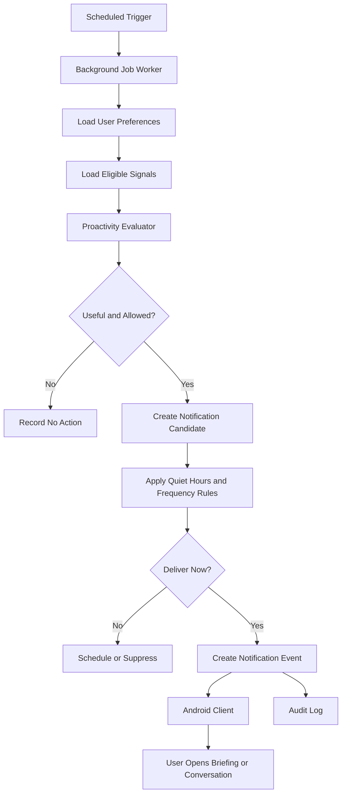

# ADR-006 — Proactive Intelligence, Background Jobs, and Notifications

**Status:** Accepted
**Date:** 2026-07-02
**Decision Owners:** Vishal Singh Kushwaha
**Related Documents:**

* `docs/03-decisions/ADR-001-memory-strategy.md`
* `docs/03-decisions/ADR-002-ai-orchestration.md`
* `docs/03-decisions/ADR-004-data-storage-and-retrieval.md`
* `docs/03-decisions/ADR-005-authentication-authorization-and-privacy.md`

---

## Context

A defining goal of Raghvi v2 is to be helpful before the user asks. It should be able to remind users about pending work, provide daily briefings, surface relevant project context, recognize user-enabled occasions, and suggest useful next steps.

However, proactive behavior can easily become distracting, intrusive, incorrect, or unsafe. Raghvi must never behave as though it has unlimited authority over the user’s time, device, relationships, or personal data.

This ADR defines how Raghvi will run scheduled and background work, decide whether a proactive message is appropriate, respect user preferences, and deliver notifications safely.

---

## Problem Statement

How should Raghvi perform scheduled checks and proactive assistance while ensuring that notifications are useful, consent-based, explainable, rate-limited, and fully controllable by the user?

---

## Decision Drivers

The approach must prioritize:

* User value over notification volume
* Explicit opt-in and user control
* Quiet hours and interruption boundaries
* Clear distinction between suggestion and autonomous action
* Reliable scheduled execution
* Auditability and explainability
* Low operational complexity for the MVP
* Safe failure behavior
* A path toward more advanced proactive intelligence later

---

## Decision

Raghvi v2 will use **bounded, opt-in proactive intelligence**.

The backend will run scheduled background jobs to evaluate user-enabled signals such as reminders, tasks, project deadlines, daily briefings, and approved calendar events. These jobs may create a proactive suggestion or notification candidate, but they must not independently execute consequential external actions.

The Android client will display approved notifications after receiving a backend notification request or synchronizing user-visible briefing data.

The MVP will begin with scheduled reminders, daily briefings, and project-progress nudges. It will not include unrestricted behavioral inference, automatic communication, or autonomous task execution.

---

## Proactive Intelligence Boundary

Raghvi may proactively:

* Remind a user about a user-created reminder
* Deliver a user-enabled daily briefing
* Surface incomplete tasks in an active project
* Suggest the next step in a project
* Notify a user about a deadline they explicitly created or connected
* Recognize user-configured special dates
* Ask whether the user wants help with a pending task

Raghvi must not proactively:

* Send messages, emails, or SMS
* Make calls
* Modify external records
* Contact another person
* Infer sensitive personal details
* Monitor private communications without explicit supported integration consent
* Repeatedly notify a user after dismissal or denial
* Present uncertain assumptions as facts

---

## High-Level Architecture



---

## Background Job Categories

### Reminder Jobs

Reminder jobs deliver reminders explicitly created by the user.

Examples:

* “Remind me to review ADR-006 tomorrow at 10 AM.”
* “Remind me every weekday to check my tasks.”

Reminder delivery is allowed because the user directly requested it.

### Daily Briefing Jobs

Daily briefing jobs create a concise summary of user-enabled information.

Possible inputs:

* Today’s reminders
* Pending project tasks
* Upcoming deadlines
* Calendar events, if the user connected calendar access
* Previous user-approved goals

A briefing should be useful even when it contains no action request.

### Project Continuity Jobs

Project continuity jobs identify relevant pending work from active projects.

Examples:

* “You completed ADR-005. ADR-006 is now ready for review.”
* “Your project has three tasks marked in progress and no recent update.”

These jobs must be conservative. They should not claim that work is overdue unless a real user-defined deadline exists.

### Occasion Jobs

Occasion jobs may recognize dates explicitly configured by the user.

Examples:

* Birthday reminders
* Important anniversaries
* Exam dates
* Interview dates
* Project release dates

The MVP must not infer personal occasions from vague conversation history.

### Notification Maintenance Jobs

These jobs handle:

* Notification deduplication
* Expired notification cleanup
* Retry scheduling
* Quiet-hour deferral
* Delivery-status reconciliation
* Suppression after repeated dismissal

---

## Proactivity Evaluation Model

Before creating a notification candidate, Raghvi evaluates:

```text
Relevance
+ user preference
+ confidence
+ urgency
+ timing
+ notification history
+ quiet-hour rules
+ user attention cost
= delivery decision
```

A notification must have a clear reason.

Example internal explanation:

```text
Reason: The user explicitly created a reminder for this time.
Confidence: High
Urgency: Medium
Notification type: Reminder
Action required: None
```

For future user-facing transparency, Raghvi should be able to explain why a notification was shown.

---

## Notification Policy

### User Controls

Users must be able to control:

* Whether proactive assistance is enabled
* Daily briefing enablement
* Reminder notifications
* Project-progress nudges
* Special-date notifications
* Quiet hours
* Notification frequency
* Individual project notification preferences
* Ability to pause proactive notifications temporarily

### Quiet Hours

Quiet hours are user-defined periods during which non-urgent proactive notifications must not be delivered.

Rules:

* Explicit reminders may be delivered according to the user’s reminder preference.
* Non-urgent briefings and nudges must be deferred.
* The system must not attempt to bypass Android notification settings.
* Quiet hours must be evaluated using the user’s configured timezone.

### Frequency Limits

The MVP should use conservative defaults.

Initial default limits:

| Notification Type                     | Default Limit                              |
| ------------------------------------- | ------------------------------------------ |
| Daily briefing                        | Maximum once per day                       |
| Project nudge                         | Maximum once per day per project           |
| General proactive suggestion          | Maximum three per week                     |
| Explicit reminder                     | Delivered according to user request        |
| Repeated notification after dismissal | Suppress unless user explicitly re-enables |

These limits may be refined after user testing.

---

## Notification Candidate Model

```yaml
id: notification_candidate_001
user_id: user_001
type: project_nudge
title: "Continue Raghvi v2 planning"
body: "ADR-006 is ready for review. Would you like to continue?"
reason: "The user recently completed ADR-005 and has an active project workflow."
confidence: 0.88
priority: normal
scheduled_for: 2026-07-03T10:00:00Z
status: pending
source_type: project_continuity_job
created_at: 2026-07-02T00:00:00Z
```

Notification content must be concise and must not expose sensitive information on a lock screen by default.

---

## Delivery and Android Responsibilities

The backend owns:

* Deciding whether a notification candidate is allowed
* Scheduling logic
* Quiet-hour evaluation
* Frequency limits
* Notification audit records
* Notification payload creation
* User preference evaluation

The Android client owns:

* Requesting Android notification permission
* Displaying notifications according to Android system rules
* Handling notification taps
* Navigating the user to the relevant screen
* Respecting device-level notification settings
* Reporting delivery or interaction events when available

The Android client must not independently invent proactive notifications outside the backend policy.

---

## Background Job Technology Direction

The MVP will use a simple scheduled-job approach compatible with the modular monolith.

Initial requirements:

* Scheduled execution
* Retry support
* Failure logging
* Idempotent job design
* Database-backed tracking of important job outcomes
* Ability to add queue workers later

The exact implementation may begin with a lightweight scheduler. Redis-backed workers or a dedicated task queue will be introduced only when workload, reliability, or concurrency requirements justify them.

Background jobs must not depend on an in-memory process state that disappears after a backend restart.

---

## Idempotency and Reliability

Background jobs must be safe to retry.

Examples:

* A daily briefing job should not create duplicate briefings for the same user and date.
* A reminder should not be delivered twice because a worker restarted.
* A failed notification should have a visible retry or failure state.

Each job should include:

* Job identifier
* User identifier
* Job type
* Scheduled time
* Idempotency key
* Status
* Attempt count
* Failure reason when applicable
* Created and updated timestamps

---

## Failure Handling

| Failure                            | Expected Behavior                                                                             |
| ---------------------------------- | --------------------------------------------------------------------------------------------- |
| Background worker unavailable      | Delay non-urgent jobs and record failure; do not fabricate delivery success.                  |
| Notification permission denied     | Do not repeatedly request it; show the user how to enable it in settings when relevant.       |
| Android device offline             | Queue delivery if supported or synchronize when the app next connects.                        |
| User disables proactive assistance | Stop generating new proactive candidates except explicitly requested reminders where allowed. |
| Calendar integration fails         | Omit calendar information and explain the limitation only when relevant.                      |
| Duplicate job execution            | Use idempotency keys and delivery-status checks.                                              |
| Low-confidence suggestion          | Suppress it rather than notify the user.                                                      |

---

## Privacy and Content Safety

Proactive notifications can expose private information. Therefore:

* Lock-screen notification text must be minimal by default.
* Sensitive details should require opening the app.
* Notifications must not reveal private memory content unnecessarily.
* The system must not mention sensitive topics in notifications unless the user explicitly configured them.
* Notification content must be generated from approved, scoped context only.
* Proactive jobs must respect memory deletion and permission revocation immediately.

---

## Alternatives Considered

### Option A — No Proactive Features

**Advantages**

* Simplest implementation
* No notification risk
* No background-job infrastructure

**Disadvantages**

* Misses a core Raghvi product differentiator
* Makes the assistant fully reactive
* Does not support reminders or daily briefings

**Decision:** Rejected.

### Option B — Fully Autonomous Proactive Agent

**Advantages**

* Highly ambitious companion experience
* Potentially powerful automation

**Disadvantages**

* High privacy risk
* Difficult to evaluate safely
* Likely intrusive
* Requires advanced permissions, workflows, and trust controls
* Not appropriate for the MVP

**Decision:** Rejected.

### Option C — Bounded, Opt-In Proactive Intelligence

**Advantages**

* Supports meaningful reminders and continuity
* Preserves user control
* Limits notification fatigue
* Can be implemented incrementally
* Creates a safe foundation for future intelligence

**Disadvantages**

* Requires preference management and scheduling
* May initially feel less “magical” than unrestricted automation
* Needs careful evaluation to remain useful

**Decision:** Accepted.

---

## Consequences

### Positive Consequences

* Raghvi can provide value without waiting for every command.
* Users retain control over notification behavior.
* Explicit reminders and briefings are reliable early use cases.
* The architecture supports future background workflows.
* Conservative defaults reduce notification fatigue and privacy risk.
* The system remains aligned with the MVP action boundary.

### Negative Consequences

* Background processing adds operational complexity.
* Notification delivery differs across Android devices and settings.
* Poorly tuned nudges can still feel intrusive.
* Scheduling and timezone handling require careful testing.
* Advanced proactive behavior remains deferred.

---

## MVP Scope

The MVP will include:

* User-created reminders
* Daily briefing opt-in
* Project-progress nudges
* Quiet hours
* Notification frequency limits
* Notification candidates and audit events
* Basic scheduled background jobs
* Android notification permission flow
* Notification tap navigation
* User controls to disable proactive assistance

The MVP will not include:

* Autonomous task execution
* Automatic communication
* Behavioral surveillance
* Unrestricted habit inference
* Background reading of private messages
* Calendar write access
* Complex multi-step background agents
* LangGraph-based durable workflows
* Advanced predictive recommendations

---

## Future Evolution

Future iterations may add:

* Calendar-aware briefings
* User-approved habit learning
* Smarter notification ranking
* Personalized briefing styles
* Durable workflow execution
* Background task queues with worker scaling
* User-configurable notification channels
* Context-aware notification suppression
* Proactive planning based on project dependencies
* LangGraph evaluation for pause-and-resume workflows

---

## Decision Gate

This ADR is accepted when the project agrees that:

* Proactivity is opt-in, bounded, and user-controlled.
* Raghvi may suggest and remind, but not autonomously perform consequential actions.
* Background jobs must be reliable, idempotent, and auditable.
* Quiet hours and frequency limits are mandatory.
* Notifications must minimize exposure of sensitive information.
* The backend owns proactive decision policy and Android owns device-level display.

---

## Interview Talking Points

* How can an AI assistant be proactive without becoming intrusive?
* Why are proactive notifications opt-in?
* How do quiet hours and frequency limits protect user experience?
* How do you prevent duplicate reminders?
* Why separate notification policy from Android notification display?
* What does idempotency mean for scheduled jobs?
* Why defer autonomous background agents?
