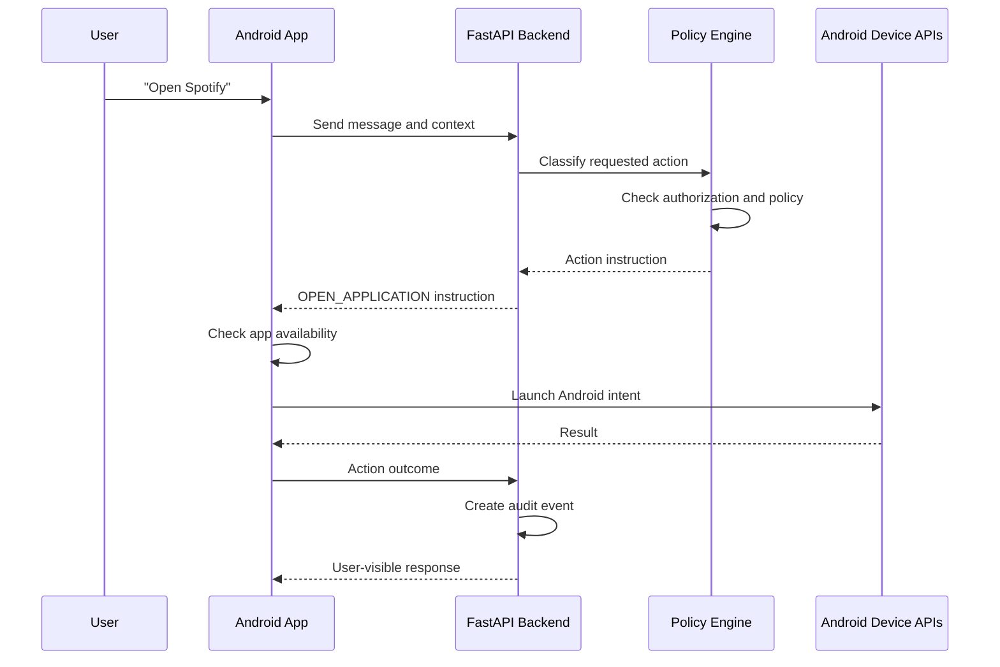
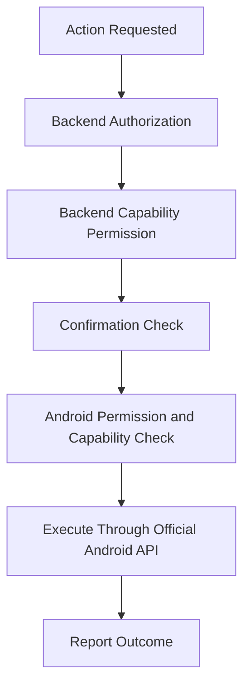

# ADR-007 — Android Device-Action Integration Strategy

**Status:** Accepted
**Date:** 2026-07-02
**Decision Owners:** Vishal Singh Kushwaha
**Related Documents:**

* `docs/03-decisions/ADR-002-ai-orchestration.md`
* `docs/03-decisions/ADR-003-backend-framework-and-runtime.md`
* `docs/03-decisions/ADR-005-authentication-authorization-and-privacy.md`
* `docs/03-decisions/ADR-006-proactive-intelligence-and-background-jobs.md`

---

## Context

Raghvi v2 is Android-first and aims to help users with everyday tasks. A key product capability is connecting natural-language requests to safe Android actions, such as opening an app, creating a reminder, displaying a notification, or preparing a communication draft.

Android actions involve operating-system permissions, device-specific behavior, user confirmation, app availability, and platform restrictions. The backend can understand intent and decide whether an action is allowed, but it cannot directly control the user’s phone.

This ADR defines the boundary between backend decision-making and Android-side execution.

---

## Problem Statement

How should Raghvi translate a user request into Android device actions while ensuring that permissions, confirmations, platform limitations, user control, and auditability are handled safely?

---

## Decision

Raghvi will use a **backend-authorized, client-executed action model**.

The FastAPI backend will interpret the request, determine the proposed action, validate authorization and product policy, and return a structured action instruction.

The Android client will validate local device capability and Android permission state, request user confirmation when required, execute supported actions through official Android APIs or intents, and report the outcome back to the backend.

The backend must never assume that an Android action succeeded until the Android client reports the result.

---

## Core Principle

```text
Backend decides whether an action may be proposed.
Android decides whether the device can execute it.
The user approves consequential actions.
Android reports the result.
Backend records the audit trail.
```

The LLM may help identify the intended action, but it must not directly invoke device capabilities.

---

## High-Level Action Flow



---

## Action Lifecycle

Every device action should follow a structured lifecycle.

```text
requested
→ proposed
→ awaiting_confirmation
→ approved
→ executing
→ succeeded
→ failed
→ cancelled
→ expired
```

Not every action requires confirmation. For example, opening an app explicitly requested in the current message may proceed directly after device capability validation.

---

## Initial Supported Actions

The MVP will support only a small, safe set of Android actions.

| Action                                | Example User Request              | Confirmation Rule                               | MVP Status          |
| ------------------------------------- | --------------------------------- | ----------------------------------------------- | ------------------- |
| Open installed app                    | “Open Spotify”                    | No additional confirmation after direct request | Included            |
| Create reminder                       | “Remind me at 7 PM”               | No additional confirmation after direct request | Included            |
| Show notification                     | “Notify me when this is ready”    | User must have enabled notifications            | Included            |
| Draft message                         | “Write a WhatsApp reply to Rahul” | User reviews draft; no automatic sending        | Included            |
| Open phone dialer with number/contact | “Call Rahul”                      | Confirmation required before opening call flow  | Deferred            |
| Open email composer with draft        | “Email my manager about leave”    | User reviews before sending                     | Deferred            |
| Create calendar event                 | “Add meeting tomorrow at 3 PM”    | Confirmation required                           | Deferred            |
| Send WhatsApp, SMS, or email          | “Send this message”               | Explicit confirmation required                  | Not included in MVP |
| Read incoming messages                | “Read my WhatsApp messages”       | Requires stronger privacy and platform review   | Not included in MVP |

---

## Structured Action Instruction

The backend must return typed action instructions rather than free-form text that the Android client interprets.

Example:

```json
{
  "action_id": "act_01HXYZ",
  "type": "open_application",
  "status": "approved",
  "requires_confirmation": false,
  "payload": {
    "application_name": "Spotify",
    "package_hint": "com.spotify.music"
  },
  "reason": "The user explicitly requested opening Spotify.",
  "expires_at": "2026-07-02T12:10:00Z"
}
```

For a confirmation-required action:

```json
{
  "action_id": "act_01HABC",
  "type": "create_calendar_event",
  "status": "awaiting_confirmation",
  "requires_confirmation": true,
  "payload": {
    "title": "Project review",
    "start_time": "2026-07-03T15:00:00+05:30",
    "duration_minutes": 30
  },
  "confirmation_summary": "Create a 30-minute calendar event named Project review tomorrow at 3:00 PM?",
  "expires_at": "2026-07-02T12:10:00Z"
}
```

The Android client must validate the action type and payload before execution.

---

## Android Intent Strategy

Raghvi will use official Android APIs and intents wherever possible.

Examples include:

* Launching installed applications through package-manager resolution
* Opening supported system settings screens
* Displaying local notifications
* Opening approved app links or deep links
* Creating reminders through Raghvi-owned reminder functionality
* Opening a dialer or email composer in future versions

Raghvi must not rely on undocumented Android behavior, accessibility-service automation, simulated touches, hidden APIs, or methods designed to bypass platform restrictions.

---

## App Launching Policy

For app-launch requests, the Android client will:

1. Receive an approved `open_application` action.
2. Search for a matching installed application.
3. Prefer an exact package match when available.
4. Ask the user to choose when multiple apps match.
5. Launch the app using an official Android intent.
6. Report success, failure, or cancellation to the backend.

If the requested app is not installed, Raghvi should clearly explain that it could not find the application and may offer to open the relevant app-store search only if that behavior is later approved.

---

## Permission Model

Android operating-system permission is separate from backend capability permission.

Example:

```text
Backend permission:
User enabled app-launch capability.

Android permission:
The device allows the required capability or intent.

Action confirmation:
The user approved this specific action if required.
```

An action can proceed only when all required layers are satisfied.



---

## Confirmation UX Rules

When confirmation is required, the Android client must show:

* The exact action
* The target or recipient
* Important content or parameters
* A clear approve option
* A clear cancel option
* No misleading urgency
* No hidden side effects

Examples:

```text
Call Rahul now?

Create a calendar event:
Project review
Tomorrow, 3:00 PM to 3:30 PM

Send this email to manager@example.com?
```

Confirmation must be tied to the specific `action_id` and must expire after a short period.

---

## Action Result Reporting

After attempting execution, Android must report an outcome to the backend.

Example:

```json
{
  "action_id": "act_01HXYZ",
  "status": "succeeded",
  "executed_at": "2026-07-02T12:02:00Z",
  "metadata": {
    "resolved_package": "com.spotify.music"
  }
}
```

Possible outcomes:

```text
succeeded
failed
cancelled
expired
unsupported
permission_denied
application_not_found
confirmation_denied
```

The backend will persist a minimal audit event and use the result to generate an accurate user response.

---

## Failure Handling

| Scenario                              | Expected Behavior                                                                 |
| ------------------------------------- | --------------------------------------------------------------------------------- |
| Requested app is not installed        | Explain that the app was not found; do not claim it opened.                       |
| Multiple apps match                   | Ask the user to choose the intended app.                                          |
| Android permission is denied          | Explain the limitation and offer settings guidance when appropriate.              |
| Confirmation expires                  | Mark the action expired and require a new request.                                |
| Device is offline                     | Queue only actions that are safe and supported; otherwise explain the limitation. |
| Backend action instruction is invalid | Android rejects it and reports a validation failure.                              |
| Android action fails unexpectedly     | Report failure without exposing sensitive system details.                         |
| User cancels action                   | Respect cancellation and record it without repeated prompting.                    |

---

## Security Requirements

Device-action integration must follow these rules:

* Android must execute only known, typed action instructions.
* The client must reject unknown action types.
* Action payloads must be validated locally.
* Action instructions must be scoped to the authenticated user.
* Instructions must have expiration timestamps.
* High-impact actions must require confirmation.
* The backend must log action status, not unnecessary private content.
* The LLM cannot bypass backend policy or Android validation.
* No background action may silently contact another person.
* The app must use official Android capabilities and platform-compliant flows.

---

## Alternatives Considered

### Option A — Backend Directly Controls Device Actions

**Advantages**

* Simple conceptual model

**Disadvantages**

* Technically inaccurate for mobile devices
* Unsafe and difficult to secure
* Cannot reliably validate local Android capability state
* Violates clear client-device boundaries

**Decision:** Rejected.

### Option B — Android Client Independently Decides and Executes Actions

**Advantages**

* Faster early implementation
* Less backend coordination

**Disadvantages**

* Inconsistent policy enforcement
* Harder auditing
* Higher risk of unsafe client-side logic
* Difficult to maintain across future clients

**Decision:** Rejected.

### Option C — Backend-Authorized, Client-Executed Actions

**Advantages**

* Clear policy boundary
* Android remains responsible for device-specific validation
* Supports auditability
* Works with future web, desktop, or iOS clients
* Prevents the LLM from directly controlling the device

**Disadvantages**

* Requires structured action contracts
* Requires action-state synchronization
* Adds client-backend coordination work

**Decision:** Accepted.

---

## Consequences

### Positive Consequences

* Raghvi can safely connect natural language to real device actions.
* Android-specific limitations remain handled by Android.
* The backend remains the source of policy and audit decisions.
* The architecture supports future action types without changing core security boundaries.
* Users retain control over consequential actions.

### Negative Consequences

* Every new action requires backend, Android, UX, and policy work.
* Some desired actions may be limited by Android platform rules.
* Action-state synchronization requires testing.
* The MVP intentionally excludes high-risk automation.

---

## MVP Scope

The MVP will include:

* Typed action instructions
* App launching through official Android intents
* User-created reminders
* Android notification support
* Message drafting without automatic sending
* Action status reporting
* Backend audit events
* Permission and confirmation boundaries

The MVP will not include:

* Automatic message sending
* Automatic calls
* Accessibility-service automation
* Reading private third-party messages
* Silent background actions
* Contact synchronization
* Calendar write actions
* File deletion or device-setting changes
* Cross-app automation that bypasses official Android APIs

---

## Future Evolution

Future versions may add:

* Email composer integration
* Dialer launch with explicit confirmation
* Calendar-event creation with confirmation
* Contact selection with user approval
* Deep-link support for more apps
* Voice-triggered actions
* Action history screen
* Per-action permission settings
* Integration-specific OAuth flows
* More advanced task workflows after safety evaluation

---

## Decision Gate

This ADR is accepted when the project agrees that:

* The backend authorizes and proposes device actions.
* Android validates and executes supported actions.
* The LLM cannot directly control the device.
* All actions use structured contracts and explicit lifecycle states.
* High-impact actions require confirmation.
* Only official Android APIs and intents are used.
* The MVP focuses on safe, user-requested actions.

---

## Interview Talking Points

* Why can’t the backend directly control a user’s Android phone?
* Why use typed action instructions instead of parsing LLM text on the client?
* How do backend authorization and Android permissions differ?
* How do you prevent unsafe mobile automation?
* Why are app launching and message drafting suitable MVP actions?
* How do you handle failed or ambiguous device actions?
* Why avoid accessibility-service automation for this project?
