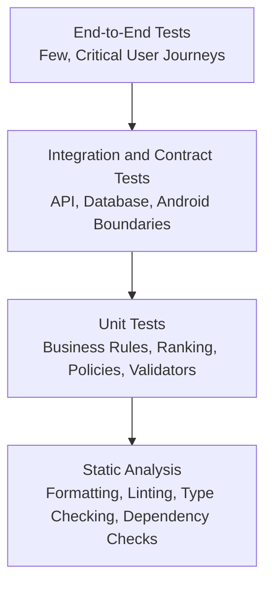
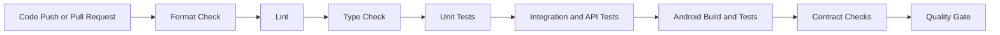

# ADR-009 — Quality Engineering, Testing, and Continuous Integration

**Status:** Accepted
**Date:** 2026-07-02
**Decision Owners:** Vishal Singh Kushwaha
**Related Documents:**

* `docs/03-decisions/ADR-003-backend-framework-and-runtime.md`
* `docs/03-decisions/ADR-004-data-storage-and-retrieval.md`
* `docs/03-decisions/ADR-007-android-device-action-integration.md`
* `docs/03-decisions/ADR-008-api-contracts-and-client-communication.md`

---

## Context

Raghvi v2 includes AI orchestration, memory, user data, mobile device actions, authentication, notifications, and backend-to-client API contracts. Failures in these areas can cause incorrect responses, duplicate reminders, privacy issues, broken Android flows, or unsafe action behavior.

The project is being built incrementally and will be used as a portfolio project. Quality engineering must therefore be built into the development workflow from the beginning rather than added after features become difficult to change.

Testing cannot guarantee that every AI response is correct, but it can verify that Raghvi’s application logic, permissions, memory boundaries, API contracts, and action workflows behave predictably.

---

## Problem Statement

How should Raghvi v2 test backend logic, Android behavior, API contracts, AI workflows, and release quality while keeping the development process efficient for a modular-monolith MVP?

---

## Decision

Raghvi v2 will use a layered quality strategy:

* Unit tests for isolated business logic
* Integration tests for database, API, and infrastructure boundaries
* Contract tests for backend-to-Android API behavior
* End-to-end tests for critical user journeys
* Evaluation tests for AI orchestration and memory quality
* Static analysis, linting, formatting, and type checking
* Continuous integration for every pull request and protected branch
* Explicit release gates for high-risk features

The project will prioritize testing critical behavior over chasing a superficial coverage percentage.

---

## Quality Pyramid



The largest number of tests should be fast unit tests. End-to-end tests should be selective because they are slower and more fragile.

---

## Testing Principles

Raghvi tests must follow these principles:

* Test behavior, not implementation details.
* Protect privacy, permission, and confirmation boundaries.
* Keep tests deterministic whenever possible.
* Use realistic but synthetic user data.
* Never use real user secrets, tokens, or private conversations in tests.
* Test failure paths, not only successful flows.
* Make high-risk behavior easy to reproduce.
* Treat AI outputs as probabilistic and validate them through structured contracts.
* Keep test setup simple enough that contributors can run it locally.

---

## Backend Testing Strategy

### Unit Tests

Backend unit tests will cover isolated domain logic.

Examples:

* Memory extraction rules
* Memory confidence and importance scoring
* Memory lifecycle transitions
* Context-ranking logic
* Permission evaluation
* Confirmation requirements
* Action-policy decisions
* Notification frequency limits
* Quiet-hour calculations
* Idempotency-key validation
* Error-code mapping
* Input validation
* API schema serialization

Unit tests should not require a live database, network call, LLM provider, or Android device.

### Integration Tests

Integration tests will validate boundaries between modules and infrastructure.

Examples:

* FastAPI route behavior
* PostgreSQL persistence
* Alembic migrations
* pgvector storage and retrieval
* Authentication token flow
* Authorization ownership checks
* Idempotency persistence
* Audit-event creation
* Background-job scheduling
* Redis behavior when Redis is introduced
* LLM Gateway adapter behavior using mocked provider responses

Integration tests may use temporary databases, containers, or isolated test schemas.

### API Tests

API tests will verify:

* Status codes
* Response schemas
* Error envelopes
* Authentication requirements
* Authorization behavior
* Pagination
* Filtering
* Idempotency behavior
* Request IDs
* Versioned route behavior

Example critical API test:

```text id="hklyrj"
Given user A owns a memory
When user B requests that memory
Then the API must not expose it
And the response must be a safe not-found or forbidden result
```

---

## Android Testing Strategy

### Unit Tests

Android unit tests will cover:

* ViewModel state transitions
* UI-state reducers
* Input validation
* DTO-to-domain mapping
* Error-code mapping
* Action-instruction validation
* Notification preference logic
* Token-session handling logic

### Instrumentation Tests

Android instrumentation tests will cover:

* Navigation between major screens
* Permission request flows
* Secure-session behavior where testable
* Notification tap handling
* App-launch intent behavior using test doubles or controlled environments
* Confirmation UI
* Memory-management flows

### UI Tests

UI tests will focus on critical user-visible journeys:

* Sign up and login
* Send a chat message
* View and delete a memory
* Create a reminder
* Review a daily briefing
* Approve or cancel an action confirmation
* Open a supported app when installed
* Handle a failed action gracefully

Android UI tests should avoid relying on unstable external apps whenever possible.

---

## AI and Memory Evaluation Strategy

AI features require a separate evaluation approach because outputs can vary.

Raghvi will use curated evaluation datasets for important behaviors.

### Initial Evaluation Categories

| Category               | Example Evaluation                                                   |
| ---------------------- | -------------------------------------------------------------------- |
| Intent classification  | Correctly identifies “open Spotify” as an app-launch request         |
| Action safety          | Does not classify “send this message” as safe without confirmation   |
| Memory extraction      | Saves a stable preference but ignores a temporary casual statement   |
| Memory retrieval       | Retrieves relevant project context without unrelated memories        |
| Privacy handling       | Does not store passwords, OTPs, API keys, or secrets                 |
| Proactive intelligence | Does not notify during quiet hours                                   |
| Response grounding     | Uses retrieved context accurately when available                     |
| Ambiguity handling     | Asks a clarification question when multiple apps or recipients match |

### Evaluation Dataset Rules

* Use synthetic or manually created test conversations.
* Label expected behavior, not only expected wording.
* Include adversarial and ambiguous cases.
* Version evaluation datasets in Git.
* Record model, prompt, and configuration used for each evaluation run.
* Do not treat one successful demo as proof of reliability.

### Structured Output Validation

Where the LLM returns structured data, the backend must validate it using Pydantic before using it.

If validation fails:

```text id="5v5x5i"
LLM output invalid
→ reject structured result
→ retry with constrained prompt when appropriate
→ fall back safely
→ log non-sensitive evaluation signal
```

The system must never execute an action based on unvalidated LLM-generated JSON.

---

## Test Environments

The project will maintain separate environments.

| Environment       | Purpose                                         |
| ----------------- | ----------------------------------------------- |
| Local development | Fast feedback during feature work               |
| Test              | Automated unit, integration, and contract tests |
| Staging           | Manual validation before release                |
| Production        | Real user environment                           |

Rules:

* Production credentials must never be used in local or test environments.
* Test databases must be isolated from production.
* Test LLM credentials should use limited-budget keys or mocked adapters.
* Staging must use synthetic or explicitly approved test data.
* Environment configuration must be managed through environment variables and secure secret storage.

---

## Static Analysis and Code Quality

### Backend

The backend will use:

* Ruff for linting and formatting
* Pyright or mypy for type checking
* Pytest for tests
* Coverage reporting for visibility
* Dependency vulnerability checks when practical

### Android

The Android client will use:

* Kotlin formatting tools
* Android Lint
* Kotlin compiler warnings treated seriously
* Unit-test and instrumentation-test tasks
* Dependency update and vulnerability review when practical

Static analysis must run before code is merged.

---

## Continuous Integration Strategy

Every pull request and push to the main branch must run automated checks.

Initial CI pipeline:



The exact CI platform may use [GitHub Actions](https://github.com/features/actions?utm_source=chatgpt.com) because the repository is hosted on [GitHub](https://github.com/?utm_source=chatgpt.com), but the workflow must remain portable.

---

## Pull Request Quality Gate

Before merging a pull request:

* Code must build successfully.
* Formatting and linting must pass.
* Type checks must pass.
* Relevant unit tests must pass.
* Relevant integration or API tests must pass.
* Android build must pass for Android-related changes.
* New behavior must include tests when practical.
* Security-sensitive changes require explicit review of authorization, permissions, confirmations, and logs.
* Database changes must include Alembic migrations.
* API changes must update OpenAPI documentation and contract tests.
* Documentation must be updated when architecture or behavior changes.

---

## Release Gates

A feature must not be released if it fails any applicable gate.

### Standard Release Gate

* CI is green.
* Required tests pass.
* No known critical defects.
* Database migrations are reviewed.
* Rollback plan exists for risky changes.
* Monitoring or logs are sufficient to diagnose failure.

### High-Risk Action Release Gate

For any feature involving device actions, permissions, external communication, memory deletion, or proactive notifications:

* Unit and integration tests cover the policy decision.
* Confirmation behavior is tested.
* Failure and cancellation paths are tested.
* Audit events are verified.
* Permission revocation behavior is verified.
* User-facing copy is reviewed for clarity.
* Manual staging validation is completed.
* The feature can be disabled through configuration or a safe rollback path.

---

## Test Data Policy

Test data must be safe and reproducible.

Allowed:

* Synthetic users
* Fictional names
* Fake email addresses
* Mock projects and tasks
* Generated messages
* Non-sensitive example memories

Not allowed:

* Real passwords
* Real API keys
* Real access tokens
* Real phone numbers
* Real private messages
* Real personal contacts
* Production database dumps without approved anonymization

---

## Coverage Policy

The project will track coverage but will not optimize for a misleading single number.

Coverage expectations:

* High coverage for policy logic, authorization, permission checks, confirmation rules, and memory lifecycle code.
* Moderate coverage for API routes and orchestration boundaries.
* Selective coverage for UI and end-to-end tests.
* Every bug fix should add a regression test when practical.

A lower coverage number is acceptable if critical behavior is well tested. A high coverage number is not useful if dangerous paths remain untested.

---

## Failure Reproduction and Debugging

When a bug is reported:

1. Create a minimal reproducible case.
2. Add or update a failing automated test.
3. Fix the implementation.
4. Confirm the test passes.
5. Review whether the issue affects privacy, authorization, or action safety.
6. Add an audit or monitoring improvement if diagnosis was difficult.

This process prevents the same defect from returning.

---

## Alternatives Considered

### Option A — Manual Testing Only

**Advantages**

* Fastest initial development
* No test infrastructure setup

**Disadvantages**

* Regressions become frequent
* Unsafe behavior is difficult to detect
* Portfolio quality is weak
* Manual testing does not scale

**Decision:** Rejected.

### Option B — Heavy End-to-End Testing First

**Advantages**

* Tests realistic user journeys
* Demonstrates visible behavior

**Disadvantages**

* Slow and brittle
* Difficult to diagnose failures
* Expensive to maintain
* Does not replace unit and integration tests

**Decision:** Rejected as the primary strategy.

### Option C — Layered Testing with CI

**Advantages**

* Fast feedback for most changes
* Strong protection for critical policies
* Balanced maintenance cost
* Supports gradual project growth
* Professional and explainable architecture

**Disadvantages**

* Requires initial setup effort
* Requires discipline to maintain tests
* AI evaluation needs ongoing dataset work

**Decision:** Accepted.

---

## Consequences

### Positive Consequences

* Critical privacy and action boundaries are protected by automated tests.
* Regressions are detected earlier.
* API and Android integration become more reliable.
* AI behavior is evaluated systematically rather than demonstrated casually.
* The project gains strong portfolio evidence of engineering discipline.
* CI creates confidence before merging changes.

### Negative Consequences

* Initial setup takes time.
* Tests require maintenance as the architecture evolves.
* AI evaluation cannot guarantee perfect responses.
* Android instrumentation tests may be slower and more complex.
* CI may need optimization as the project grows.

---

## MVP Scope

The MVP will include:

* Backend unit tests
* Backend API tests
* Database migration tests
* Android unit tests
* Selected Android UI or instrumentation tests
* Linting and formatting
* Python type checking
* Android Lint
* GitHub Actions CI
* Basic AI evaluation dataset
* Structured-output validation tests
* Pull-request quality checks

The MVP will not include:

* Full load testing
* Chaos engineering
* Large-scale performance testing
* Full mutation testing
* Device-farm testing
* Formal penetration testing
* Automated visual-regression testing
* Enterprise-grade observability platform

---

## Future Evolution

Future iterations may add:

* Contract-test generation from OpenAPI
* Performance and load tests
* Android device-farm testing
* Security scanning and dependency automation
* Mutation testing for critical policy code
* Automated prompt regression testing
* Offline evaluation dashboards
* Canary releases
* Feature flags
* Formal threat modeling and external security review

---

## Decision Gate

This ADR is accepted when the project agrees that:

* Testing is layered rather than manual-only.
* Critical policies receive stronger test coverage than cosmetic behavior.
* AI outputs are validated and evaluated through structured tests.
* CI runs on pull requests and main-branch changes.
* High-risk features require explicit release gates.
* Test data must be synthetic and privacy-safe.
* Quality is treated as part of product architecture.

---

## Interview Talking Points

* How do you test an AI assistant when model outputs vary?
* Why is code coverage not enough?
* How do you test permissions and confirmation boundaries?
* What is the difference between unit, integration, contract, and end-to-end tests?
* How do idempotency and API tests protect mobile users?
* Why are synthetic datasets important for AI evaluation?
* What checks should block a risky feature release?
