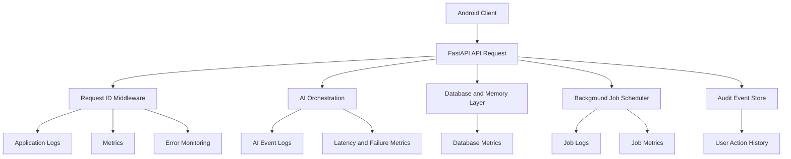

# ADR-010 — Observability, Logging, Monitoring, and Incident Response

**Status:** Accepted
**Date:** 2026-07-02
**Decision Owners:** Vishal Singh Kushwaha
**Related Documents:**

* `docs/03-decisions/ADR-005-authentication-authorization-and-privacy.md`
* `docs/03-decisions/ADR-006-proactive-intelligence-and-background-jobs.md`
* `docs/03-decisions/ADR-007-android-device-action-integration.md`
* `docs/03-decisions/ADR-008-api-contracts-and-client-communication.md`
* `docs/03-decisions/ADR-009-quality-engineering-and-ci.md`

---

## Context

Raghvi v2 includes a FastAPI backend, Android client, authentication, user memory, AI orchestration, background jobs, notifications, and device-action workflows. When something fails, the project needs enough visibility to answer practical questions:

* Did the user’s request reach the backend?
* Did the AI orchestration step fail, time out, or return invalid output?
* Was a memory retrieved, created, updated, or deleted?
* Was a reminder generated but suppressed by quiet hours?
* Did Android receive and execute a device-action instruction?
* Did an API request fail because of authentication, authorization, validation, or infrastructure?
* Is a failure affecting one user, one release, or the entire system?

Observability must help diagnose issues without exposing private user conversations, secrets, authentication tokens, or sensitive memory content.

---

## Problem Statement

How should Raghvi collect logs, metrics, traces, audit events, health signals, alerts, and incident records so that failures can be detected and investigated while preserving privacy?

---

## Decision

Raghvi v2 will use a **privacy-first observability model** built around:

* Structured application logs
* Request correlation IDs
* Minimal audit events for sensitive actions
* Health and readiness checks
* Core service metrics
* Error monitoring
* Background-job monitoring
* Release-aware diagnostics
* A lightweight incident-response process

The MVP will prioritize clear structured logs, request IDs, health endpoints, error tracking, and a small set of actionable metrics before introducing a complex observability stack.

---

## Observability Principles

Raghvi observability must follow these principles:

* Log events, not private user content.
* Correlate related operations through request IDs and action IDs.
* Separate operational logs from user-facing audit history.
* Capture failures with enough context to debug safely.
* Avoid logging secrets, tokens, passwords, OTPs, raw private messages, or full memory content.
* Prefer aggregated metrics for product and performance insight.
* Make critical failures visible quickly.
* Keep the MVP simple enough to operate as a solo project.
* Treat observability configuration as code where practical.

---

## Observability Model



---

## Structured Logging Standard

Backend logs must be structured JSON logs in production environments.

Each log event should include:

```json
{
  "timestamp": "2026-07-02T12:00:00Z",
  "level": "INFO",
  "service": "raghvi-backend",
  "environment": "staging",
  "event": "conversation_message_received",
  "request_id": "req_01HXYZ",
  "user_id_hash": "hashed_or_pseudonymous_value",
  "conversation_id": "conv_01HXYZ",
  "duration_ms": 142,
  "status": "success"
}
```

The exact fields may vary by event type, but the core naming convention must remain consistent.

---

## Logging Levels

| Level      | Usage                                                                              |
| ---------- | ---------------------------------------------------------------------------------- |
| `DEBUG`    | Detailed development diagnostics; disabled or heavily restricted in production     |
| `INFO`     | Normal lifecycle events and successful operational milestones                      |
| `WARNING`  | Recoverable issues, retries, degraded behavior, unexpected but handled states      |
| `ERROR`    | Failed operations requiring investigation                                          |
| `CRITICAL` | Major service failure, data-integrity risk, security incident, or sustained outage |

Production logs should avoid excessive `INFO` noise. High-volume events should be sampled or aggregated when needed.

---

## Data That Must Never Be Logged

The following data must never appear in application logs, error reports, traces, or analytics events:

* Passwords
* Access tokens
* Refresh tokens
* API keys
* OTPs
* Full authorization headers
* Full private conversation messages
* Full memory content
* Raw contact lists
* Phone numbers unless explicitly required for a security investigation and safely redacted
* Email bodies
* Device identifiers that are not necessary for the event
* Sensitive personal information
* Unredacted third-party integration payloads

When debugging content-related issues, use synthetic test data, redacted samples, or explicitly approved development-only records.

---

## Request Correlation

Every backend request must have a request ID as defined in ADR-008.

```text
Android request
→ X-Request-ID
→ FastAPI middleware
→ logs
→ API response
→ background job metadata
→ audit event where applicable
```

For long-running workflows, additional identifiers may be used:

* `conversation_id`
* `message_id`
* `action_id`
* `job_id`
* `notification_candidate_id`
* `memory_id`

These IDs allow investigation without storing private message content.

---

## Audit Events vs Operational Logs

Operational logs and audit events serve different purposes.

### Operational Logs

Used by developers to diagnose system behavior.

Examples:

* API request completed
* Database query failed
* Background job retried
* LLM provider timed out
* Android action outcome received

Operational logs may be short-lived and access-restricted.

### Audit Events

Used to record user-relevant or security-relevant actions.

Examples:

* Memory created
* Memory deleted
* Permission granted or revoked
* Device action proposed
* Device action confirmed
* Device action completed or failed
* Reminder created
* Proactive notification suppressed
* Account session revoked

Audit events must be minimal, user-scoped, and durable enough to support user transparency and debugging.

---

## Audit Event Schema

```json
{
  "id": "audit_01HXYZ",
  "user_id": "user_01HXYZ",
  "event_type": "device_action_confirmed",
  "resource_type": "action",
  "resource_id": "act_01HXYZ",
  "status": "success",
  "request_id": "req_01HXYZ",
  "created_at": "2026-07-02T12:00:00Z",
  "metadata": {
    "action_type": "open_application"
  }
}
```

Audit metadata must remain minimal and must not store unnecessary private content.

---

## Core Metrics

The MVP should track a focused set of metrics.

### API Metrics

* Request count by endpoint
* Request latency
* Error rate by status code
* Authentication failures
* Rate-limit events
* Active API version usage

### AI Orchestration Metrics

* AI request count
* AI response latency
* Provider failure rate
* Structured-output validation failures
* Tool or action classification rate
* Fallback usage
* Token or cost estimates when available

### Memory Metrics

* Memory creation count
* Memory update count
* Memory deletion count
* Retrieval latency
* Retrieval result count
* Low-confidence memory suppression count
* Memory extraction validation failures

### Background Job Metrics

* Scheduled job count
* Job success rate
* Job failure rate
* Retry count
* Delayed job count
* Notification suppression count
* Duplicate-prevention events

### Android Action Metrics

* Action proposal count
* Confirmation approval rate
* Confirmation cancellation rate
* Action success rate
* Action failure rate
* Unsupported action count
* Permission-denied count
* App-not-found count

Metrics should use aggregated labels and avoid high-cardinality user-specific labels.

---

## Health and Readiness Endpoints

The backend will expose separate health endpoints.

```text
GET /health/live
GET /health/ready
```

### Liveness Check

The liveness endpoint confirms that the application process is running.

Example response:

```json
{
  "status": "ok"
}
```

### Readiness Check

The readiness endpoint confirms that required dependencies are available.

Example checks:

* Database connectivity
* Required configuration presence
* Migration compatibility
* Optional AI provider availability where appropriate
* Background-job scheduler state

Example response:

```json
{
  "status": "ready",
  "dependencies": {
    "database": "ok",
    "scheduler": "ok"
  }
}
```

The readiness endpoint must not expose secrets or detailed infrastructure internals publicly.

---

## Error Monitoring

The project will use an error-monitoring service or self-hosted equivalent when deployed beyond local development.

Error reports should include:

* Exception type
* Sanitized stack trace
* Request ID
* Endpoint or operation name
* Release version
* Environment
* Non-sensitive contextual metadata

Error reports must be scrubbed before transmission.

A production error report must never include full conversation content or authentication credentials.

---

## Release Version Tracking

Every backend and Android release should have a version identifier.

Recommended fields:

```text
service_version
android_app_version
git_commit_sha
deployment_environment
build_timestamp
```

This allows a failure to be linked to a specific release.

Example:

```json
{
  "event": "api_error",
  "service_version": "0.3.0",
  "git_commit_sha": "abc123",
  "environment": "staging",
  "request_id": "req_01HXYZ"
}
```

---

## Background Job Monitoring

Background jobs require explicit visibility because they may fail without an active user request.

Each job should record:

* Job ID
* Job type
* Scheduled time
* Start time
* Completion time
* Status
* Attempt count
* Retry reason
* Request ID when initiated from a user request
* User ID hash or pseudonymous identifier when necessary

The system should detect:

* Jobs stuck in running state
* Repeated failures
* Excessive retry loops
* Large queues
* Missed scheduled runs
* Duplicate execution attempts

---

## Alerting Policy

The MVP should use a small number of actionable alerts.

Alerts should be triggered for:

* Sustained elevated API error rate
* Backend unavailable or readiness failure
* Database unavailable
* Repeated background-job failures
* High authentication failure spikes
* High AI provider failure rate
* Sudden action-execution failure spike
* Critical security or data-integrity event

Avoid alerting on every individual error. Alerts should indicate a meaningful issue requiring attention.

---

## Incident Response Process

For the MVP, incident response will follow a lightweight process.

### Incident Severity

| Severity | Description                                                                                     |
| -------- | ----------------------------------------------------------------------------------------------- |
| SEV-1    | Security incident, data exposure, data loss, or full service outage                             |
| SEV-2    | Major feature unavailable for many users, repeated action failures, or sustained backend errors |
| SEV-3    | Limited feature issue, degraded performance, or isolated user-impacting defect                  |
| SEV-4    | Minor defect, documentation issue, or non-urgent improvement                                    |

### Incident Workflow

```text
Detect
→ assess severity
→ contain impact
→ communicate status when needed
→ investigate with logs and metrics
→ fix or roll back
→ verify recovery
→ write a short post-incident note
→ add regression prevention
```

For high-risk issues, the first priority is to stop unsafe behavior. This may include disabling a feature flag, pausing background jobs, or blocking an action type.

---

## Post-Incident Notes

For SEV-1 and SEV-2 incidents, create a short incident note containing:

* What happened
* User impact
* Detection method
* Timeline
* Root cause
* Immediate mitigation
* Long-term corrective actions
* Tests, alerts, or documentation added afterward

The purpose is learning and prevention, not blame.

---

## Privacy Review for New Telemetry

Before adding a new log field, metric label, trace attribute, or analytics event, ask:

1. Is this information necessary to operate or improve the system?
2. Can it be aggregated, hashed, or redacted?
3. Could it expose private user content?
4. How long should it be retained?
5. Who needs access?
6. Can the same debugging goal be achieved with less data?

If the answer is unclear, do not collect the field until it is reviewed.

---

## Alternatives Considered

### Option A — Console Logs Only

**Advantages**

* Fastest initial setup
* Minimal infrastructure

**Disadvantages**

* Difficult to investigate deployed failures
* No correlation across requests and jobs
* No metrics or alerts
* Not sufficient for device-action or memory workflows

**Decision:** Rejected.

### Option B — Full Enterprise Observability Stack from Day One

**Advantages**

* Extensive tracing, dashboards, and analytics
* Strong scalability potential

**Disadvantages**

* High cost and setup complexity
* Too much operational overhead for the MVP
* Risks collecting unnecessary data
* Slows feature development

**Decision:** Deferred.

### Option C — Privacy-First Structured Observability

**Advantages**

* Strong debugging foundation
* Supports safe operation of critical features
* Keeps operational complexity manageable
* Can evolve toward distributed tracing and dashboards later
* Aligns with user privacy expectations

**Disadvantages**

* Requires discipline in log design
* Initial metrics may be limited
* Some issues may still require manual investigation

**Decision:** Accepted.

---

## Consequences

### Positive Consequences

* Failures can be traced through request IDs and action IDs.
* Background jobs become observable rather than silent.
* Privacy-sensitive data is protected by logging rules.
* Releases can be linked to regressions.
* Critical failures can trigger actionable alerts.
* Incident response becomes repeatable and professional.

### Negative Consequences

* Structured logging and metrics add implementation work.
* Log redaction must be maintained carefully.
* Monitoring tools may introduce cost later.
* Too many metrics can create noise if not reviewed.
* Developers must consistently follow telemetry standards.

---

## MVP Scope

The MVP will include:

* Structured backend logs
* Request IDs
* Minimal audit events
* Liveness and readiness endpoints
* Core API error and latency metrics
* Background-job status metrics
* Basic AI failure and latency metrics
* Release version tracking
* Error monitoring with sanitization
* Small actionable alert set
* Lightweight incident notes for serious issues

The MVP will not include:

* Full distributed tracing
* Complex observability data warehouse
* Real-time product analytics platform
* Enterprise SIEM integration
* Automated incident remediation
* Multi-region monitoring
* Advanced anomaly detection

---

## Future Evolution

Future iterations may add:

* OpenTelemetry traces
* Centralized dashboards
* Service-level objectives and error budgets
* Feature-flag observability
* AI quality dashboards
* Notification engagement metrics
* Cost monitoring by provider and feature
* Automated alert routing
* Security event correlation
* Long-term audit retention policies

---

## Decision Gate

This ADR is accepted when the project agrees that:

* Operational visibility must not compromise user privacy.
* Structured logs and request IDs are mandatory.
* Audit events are separate from operational logs.
* Health checks and core metrics are required for deployment.
* Background jobs and device actions must be observable.
* Alerts must be actionable rather than noisy.
* Serious incidents require a short learning-focused follow-up.

---

## Interview Talking Points

* How do you debug an AI assistant without logging private conversations?
* Why are audit events different from operational logs?
* How do request IDs help trace a failure across services?
* What metrics would you monitor for background jobs and device actions?
* Why separate liveness and readiness checks?
* How do you decide which alerts are worth waking someone up for?
* How do you handle a production incident involving unsafe automation?
