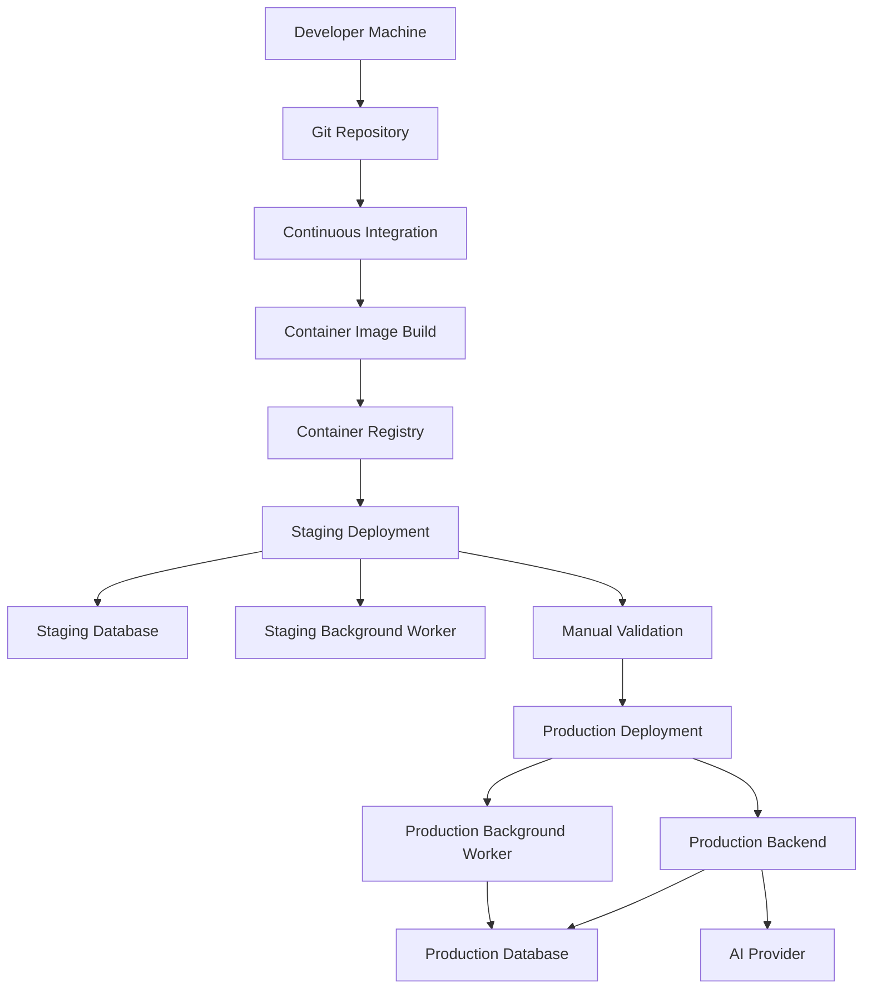

# ADR-011 — Deployment, Environments, Secrets Management, and Release Strategy

**Status:** Accepted
**Date:** 2026-07-02
**Decision Owners:** Vishal Singh Kushwaha
**Related Documents:**

* `docs/03-decisions/ADR-003-backend-framework-and-runtime.md`
* `docs/03-decisions/ADR-004-data-storage-and-retrieval.md`
* `docs/03-decisions/ADR-005-authentication-authorization-and-privacy.md`
* `docs/03-decisions/ADR-008-api-contracts-and-client-communication.md`
* `docs/03-decisions/ADR-009-quality-engineering-and-ci.md`
* `docs/03-decisions/ADR-010-observability-logging-monitoring-and-incident-response.md`

---

## Context

Raghvi v2 includes a FastAPI backend, PostgreSQL database, AI-provider integrations, background jobs, an Android client, user memory, authentication, and notification workflows.

A local development setup is enough for early implementation, but the project needs a safe and repeatable path to staging and production. Without a defined deployment strategy, common problems can occur:

* Environment variables differ between machines.
* Secrets are accidentally committed to Git.
* Database migrations are applied inconsistently.
* A backend release breaks the Android client.
* Production issues cannot be rolled back quickly.
* Test data mixes with real user data.
* AI provider keys are exposed or misused.
* A developer cannot reproduce the deployed environment.

This ADR defines how Raghvi will separate environments, manage secrets, deploy services, run migrations, and release backend and Android updates safely.

---

## Problem Statement

How should Raghvi v2 deploy and operate its backend, database, background jobs, and Android client across local development, test, staging, and production environments while protecting secrets and enabling safe releases?

---

## Decision

Raghvi v2 will use a **containerized backend deployment model with environment separation, managed secret storage, migration-controlled database changes, and staged releases**.

The backend will be packaged as a Docker container. Local development will use Docker Compose for dependent services such as PostgreSQL and Redis when needed. Staging and production will use separate infrastructure, separate databases, separate secrets, and separate configuration.

Database schema changes will be managed through Alembic migrations. Migrations must be reviewed, tested, and applied as part of the deployment process.

Android releases will be versioned independently from backend releases and distributed first through internal testing channels before broader release.

---

## Environment Model

Raghvi will maintain these environments:

| Environment | Purpose                              | Data Policy                              |
| ----------- | ------------------------------------ | ---------------------------------------- |
| Local       | Individual development and debugging | Synthetic local data only                |
| Test        | Automated CI tests                   | Ephemeral or isolated synthetic data     |
| Staging     | Manual validation before release     | Synthetic or approved test accounts only |
| Production  | Real user environment                | Real user data with strict controls      |

Each environment must have separate:

* Database instances
* Environment variables
* Secret values
* AI provider keys where practical
* Authentication configuration
* Notification configuration
* Logging and monitoring configuration
* Deployment targets

Production data must never be copied into local or test environments without explicit approved anonymization.

---

## Deployment Architecture



---

## Backend Containerization

The FastAPI backend will run in a Docker container.

The container should include:

* Python runtime
* Application dependencies
* Application source code
* Production ASGI server configuration
* Health-check support
* Non-root execution where practical
* Minimal required operating-system packages

The container must not include:

* Production secrets
* Local `.env` files
* Test fixtures that contain sensitive data
* Development-only credentials
* Unnecessary build tools in the final runtime image

A multi-stage Docker build may be introduced when image size or build speed becomes important.

---

## Local Development with Docker Compose

Local development will use Docker Compose for infrastructure dependencies.

Initial local services:

```text id="grkbrw"
backend
postgres
```

Future optional services:

```text id="q5mzfs"
redis
background-worker
scheduler
mail-test-server
```

The Android application may run directly through Android Studio while connecting to a local backend exposed through a development URL or emulator-compatible host configuration.

Local development must be documented in the repository README and developer setup guide.

---

## Configuration Management

Configuration must be environment-driven.

Examples:

```text id="t0uj5z"
ENVIRONMENT=local
DATABASE_URL=postgresql+psycopg://...
JWT_SECRET_KEY=...
AI_PROVIDER_API_KEY=...
LOG_LEVEL=INFO
CORS_ALLOWED_ORIGINS=...
```

Rules:

* Configuration must be validated at application startup.
* Missing required production configuration must fail fast.
* Secrets must never have insecure default values in production.
* Local `.env` files must be ignored by Git.
* A safe `.env.example` file may document required variable names without real values.
* Environment-specific behavior must be explicit and testable.

---

## Secrets Management

Secrets include:

* JWT signing keys
* Database credentials
* AI provider API keys
* Notification provider credentials
* OAuth client secrets
* Third-party integration tokens
* Encryption keys

Secrets must follow these rules:

* Never commit secrets to Git.
* Never place secrets in source code.
* Never log secrets.
* Use environment variables only as a delivery mechanism, not as a reason to store secrets in repository files.
* Use a managed secret store in staging and production when available.
* Rotate secrets when exposure is suspected.
* Use separate keys for local, staging, and production environments.
* Restrict access based on least privilege.
* Remove unused secrets promptly.

For local development, developers may use a local `.env` file created from `.env.example`.

---

## Database Migration Strategy

All schema changes must use Alembic migrations.

Migration workflow:

```text id="fj9s2f"
Change database model
→ generate or write migration
→ review migration
→ test migration locally
→ run migration in CI
→ deploy to staging
→ validate staging
→ deploy to production
→ monitor
```

Rules:

* Never manually alter production schema outside the migration process.
* Every migration must be reversible when practical.
* Destructive migrations require a backup and rollback plan.
* Large data migrations should be separated from schema migrations when possible.
* Migrations must be compatible with rolling deployments where practical.
* The backend must not require a schema version that has not yet been applied.

---

## Migration Safety Rules

For risky schema changes:

* Add new columns as nullable or with safe defaults first.
* Deploy code that can handle both old and new schema states.
* Backfill data in controlled jobs if needed.
* Validate data migration completion.
* Enforce stricter constraints only after validation.
* Remove deprecated columns in a later release.

This reduces downtime and makes rollback safer.

---

## Backend Release Strategy

Backend releases will follow staged deployment.

```text id="r3lt2q"
Local development
→ pull request checks
→ staging deployment
→ manual validation
→ production deployment
→ monitoring
→ rollback if needed
```

Each backend release should include:

* Semantic or date-based version identifier
* Git commit SHA
* Migration status
* Deployment timestamp
* Environment
* Release notes for meaningful changes

Production deployment should happen only when CI is green and staging validation is complete for significant changes.

---

## Rollback Strategy

Rollback must be planned before risky releases.

### Application Rollback

If a backend release causes errors:

1. Deploy the previously known-good container image.
2. Verify health and readiness checks.
3. Confirm API error rates recover.
4. Investigate using request IDs, logs, and release metadata.
5. Create a regression test before re-releasing the fix.

### Database Rollback

Database rollback is more complex.

Rules:

* Prefer forward-fix migrations when data has already changed.
* Use downgrade migrations only when safe and tested.
* Back up production before destructive schema changes.
* Avoid releases that require immediate irreversible data transformation.
* Separate application rollback from schema rollback when possible.

---

## Feature Flags

The MVP may use simple configuration-based feature flags for risky or incomplete capabilities.

Examples:

```text id="7mrg3s"
ENABLE_PROACTIVE_NOTIFICATIONS=false
ENABLE_DEVICE_ACTIONS=true
ENABLE_CALENDAR_INTEGRATION=false
ENABLE_MEMORY_EXTRACTION=true
```

Feature flags should be used for:

* Gradual rollout
* Emergency disablement
* Staging-only features
* High-risk integrations
* Experimental AI workflows

Feature flags must not become a permanent substitute for removing dead code.

---

## Android Release Strategy

Android releases will be versioned independently.

Initial release path:

```text id="6vw6td"
Local debug build
→ internal testing build
→ closed testing track
→ production release
```

Before broader release:

* Core user journeys must be tested.
* API compatibility must be verified.
* Notification and permission flows must be manually tested.
* Device-action behavior must be tested on supported Android versions.
* Crash reports must be reviewed.
* Release notes must summarize user-visible changes.

The Android client should gracefully handle backend incompatibility through API versioning, clear error states, and minimum supported app-version checks if needed later.

---

## Release Compatibility

Backend and Android releases must be compatible during staged rollout.

Rules:

* Backend changes should be backward compatible within `/api/v1` whenever possible.
* New API fields should be additive before becoming required.
* Android should ignore unknown response fields safely.
* Backend should support recently released Android versions for a reasonable transition period.
* Breaking API changes require a new API version or coordinated release plan.
* Device-action instruction changes require contract tests.

---

## Deployment Health Checks

Before considering a deployment successful, verify:

* Container starts successfully.
* Liveness endpoint responds.
* Readiness endpoint confirms dependencies.
* Database migrations completed.
* Authentication flow works.
* A basic conversation request succeeds.
* Background jobs are running if enabled.
* Error monitoring receives events.
* No abnormal spike in error rate or latency appears.

---

## Infrastructure Provider Strategy

The project will avoid locking itself into a complex provider during the MVP.

The deployment target should support:

* Docker containers
* Managed PostgreSQL
* Environment-based configuration
* Managed secrets or secure secret injection
* HTTPS
* Basic logs and metrics
* Separate staging and production environments
* Reasonable cost for an early portfolio project

Potential deployment platforms may include [Render](https://render.com?utm_source=chatgpt.com), [Railway](https://railway.com?utm_source=chatgpt.com), [Fly.io](https://fly.io?utm_source=chatgpt.com), or a cloud provider such as [Google Cloud](https://cloud.google.com?utm_source=chatgpt.com). The final provider will be selected later based on cost, managed database support, deployment simplicity, and free-tier availability.

---

## Backup and Recovery

Production data must have a recovery plan.

Minimum production backup requirements:

* Automated database backups
* Backup retention policy
* Ability to restore to a non-production environment for verification
* Backup status monitoring
* Documented recovery steps
* Controlled access to backups

Backups must be encrypted and treated as sensitive user data.

---

## Security Controls for Deployment

Deployment must include:

* HTTPS-only API access
* Secure secret injection
* Restricted database network access
* Production debug mode disabled
* CORS restricted to approved origins
* Dependency updates reviewed regularly
* Container images built from trusted base images
* Least-privilege service credentials
* Access logging for deployment systems where available

---

## Alternatives Considered

### Option A — Manual Server Deployment

**Advantages**

* Full control
* Can be inexpensive for a single server

**Disadvantages**

* Higher maintenance burden
* Harder secret management
* More risk of configuration drift
* More difficult rollback and monitoring
* Not ideal for an early solo portfolio project

**Decision:** Rejected for the MVP.

### Option B — Serverless-Only Architecture

**Advantages**

* Low infrastructure management
* Potentially easy scaling

**Disadvantages**

* Background jobs and long-running AI workflows may be more complicated
* Database connection handling can be less straightforward
* Local development may diverge from production
* Adds platform-specific constraints early

**Decision:** Deferred.

### Option C — Containerized Backend with Managed Services

**Advantages**

* Reproducible deployments
* Good local-to-production consistency
* Flexible provider choice
* Supports background workers and future scaling
* Clear operational model for a portfolio project

**Disadvantages**

* Requires Docker knowledge
* Managed services may introduce cost
* Deployment configuration requires maintenance

**Decision:** Accepted.

---

## Consequences

### Positive Consequences

* Environments remain isolated.
* Secrets are less likely to be exposed.
* Database changes become repeatable and reviewable.
* Releases can be staged and rolled back.
* Backend deployment remains portable across providers.
* Android and backend compatibility are managed deliberately.
* The project gains a professional operational foundation.

### Negative Consequences

* Docker, Compose, migrations, and CI add setup work.
* Multiple environments increase configuration overhead.
* Managed databases and secret stores may have cost.
* Rollback planning requires discipline.
* Deployment documentation must remain current.

---

## MVP Scope

The MVP will include:

* Dockerized FastAPI backend
* Docker Compose for local backend and PostgreSQL
* Local, test, staging, and production environment separation
* `.env.example` and Git-ignored local `.env`
* Alembic migrations
* CI container build validation
* Staging deployment before major production releases
* Basic health checks
* Release version tracking
* Configuration-based feature flags
* Internal Android testing release path
* Production database backup plan

The MVP will not include:

* Kubernetes
* Multi-region deployment
* Blue-green deployment infrastructure
* Full infrastructure-as-code platform
* Automated database failover
* Enterprise secret-management workflows
* Advanced canary deployment system
* Complex service mesh

---

## Future Evolution

Future iterations may add:

* Infrastructure as code using Terraform or Pulumi
* Managed queue and worker infrastructure
* Blue-green or canary deployments
* Automated rollback based on error rates
* Database read replicas
* Multi-region deployment
* Advanced feature-flag platform
* Container vulnerability scanning
* Automated backup restore testing
* Deployment approval workflows
* Formal disaster recovery exercises

---

## Decision Gate

This ADR is accepted when the project agrees that:

* The backend is containerized.
* Local, test, staging, and production environments remain separate.
* Secrets are never committed to Git or logged.
* Database changes use Alembic migrations.
* Significant releases pass through staging.
* Rollback and backup planning are required for risky changes.
* Android releases are tested independently and remain API-compatible.
* Deployment choices remain simple and portable for the MVP.

---

## Interview Talking Points

* Why use containers for a FastAPI backend?
* How do you prevent secrets from leaking into Git or logs?
* Why are database migrations part of deployment rather than manual work?
* How do you make schema changes safe during a live release?
* What is the difference between application rollback and database rollback?
* Why separate staging from production?
* How do you keep Android and backend releases compatible?
