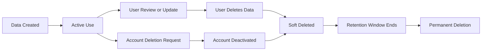

# ADR-012 — Data Retention, Deletion, Export, and Account Lifecycle

**Status:** Accepted
**Date:** 2026-07-02
**Decision Owners:** Vishal Singh Kushwaha
**Related Documents:**

* `docs/03-decisions/ADR-004-data-storage-and-retrieval.md`
* `docs/03-decisions/ADR-005-authentication-authorization-and-privacy.md`
* `docs/03-decisions/ADR-006-proactive-intelligence-and-background-jobs.md`
* `docs/03-decisions/ADR-010-observability-logging-monitoring-and-incident-response.md`
* `docs/03-decisions/ADR-011-deployment-environments-secrets-and-release-strategy.md`

---

## Context

Raghvi v2 stores user-related data to provide personalized assistance. This may include account details, conversations, memories, preferences, reminders, tasks, projects, notification settings, permissions, action confirmations, and audit events.

Personalization is useful only when users can understand, control, review, export, and delete their data. Without clear lifecycle rules, the system can retain outdated, unwanted, or unnecessary information indefinitely.

This ADR defines how Raghvi handles data retention, user deletion requests, exports, account deactivation, and recovery.

---

## Problem Statement

How should Raghvi v2 retain, delete, export, recover, and manage user data while balancing personalization, privacy, operational reliability, and future legal compliance?

---

## Decision

Raghvi v2 will use a **user-controlled data lifecycle model** with the following principles:

* Users can review and delete supported personal data.
* Users can export their core account data.
* Account deletion triggers a defined deletion workflow.
* Data is retained only for a documented purpose.
* Soft deletion may be used temporarily for recovery and operational safety.
* Permanent deletion occurs after a defined retention window.
* Backups follow separate retention and recovery rules.
* Audit events retain minimal data and are not treated as a hidden copy of user content.
* Memory must be editable, removable, and correctable by the user.

---

## Data Categories

| Category              | Examples                                                 | User Control Level                                    |
| --------------------- | -------------------------------------------------------- | ----------------------------------------------------- |
| Account data          | Name, email, profile settings                            | View, edit, export, delete account                    |
| Conversation data     | Messages, conversation metadata                          | View, export, delete                                  |
| Memory data           | Preferences, projects, goals, user facts                 | View, edit, delete, export                            |
| Productivity data     | Tasks, reminders, projects, schedules                    | View, edit, delete, export                            |
| Permission data       | Notification settings, device-action permissions         | View, revoke, export                                  |
| Action data           | Confirmations, action outcomes                           | View, export where appropriate                        |
| Audit events          | Permission changes, memory deletion, action confirmation | Limited user visibility and controlled retention      |
| Operational telemetry | Error counts, latency, anonymized metrics                | Not directly editable; minimized and retained briefly |
| Backups               | Encrypted database backups                               | Not directly editable; expires under backup policy    |

---

## Data Lifecycle Model



The system must distinguish between:

* Active data
* Soft-deleted data
* Permanently deleted data
* Archived operational records
* Backup copies awaiting expiration

---

## Memory Lifecycle Rules

Memory is central to Raghvi’s personalization and must remain user-controlled.

Each memory should support:

* Creation source
* Creation timestamp
* Last updated timestamp
* Confidence score
* Importance score
* Status
* User review state
* Deletion state

Suggested memory statuses:

```text
active
needs_review
superseded
deleted
expired
```

Rules:

* Users can delete a memory at any time.
* Users can correct inaccurate memories.
* Newer confirmed information may supersede older information.
* Temporary context should not automatically become permanent memory.
* Sensitive information must not be stored without explicit user confirmation where required.
* Deleted memories must not be retrieved for future AI responses.
* A memory deletion should create a minimal audit event without storing the deleted memory content.

---

## Conversation Retention

Conversation retention must be configurable and understandable.

Initial MVP policy:

* Conversations remain available until the user deletes them or deletes their account.
* Users can delete an individual conversation.
* Deleted conversations must no longer appear in normal retrieval or AI context.
* Conversation deletion should remove associated message content from active storage.
* Internal metadata retained for limited operational purposes must not contain full message content.
* Future versions may allow users to choose automatic conversation retention periods.

The system must not silently retain deleted conversation content for personalization.

---

## Reminder, Task, and Project Retention

Productivity data remains active while useful.

Rules:

* Completed reminders and tasks may remain visible to users.
* Users can delete completed or inactive productivity data.
* Expired reminders should not continue triggering notifications.
* Deleted tasks and reminders must not appear in proactive briefings.
* Project data should remain available until deleted by the user or removed during account deletion.
* Historical completion data may be retained only when it supports a visible user feature.

---

## Soft Deletion Policy

Soft deletion provides a short recovery window and protects against accidental deletion.

Initial policy:

```text
Soft deletion retention window: 30 days
```

During this period:

* Deleted data is excluded from normal user views.
* Deleted data is excluded from AI retrieval.
* Deleted data is excluded from proactive workflows.
* Access is restricted to authorized recovery workflows.
* The user may restore eligible data if the feature is available.
* The system may permanently purge data earlier when required for security or privacy reasons.

After the retention window, data should be permanently deleted from primary storage.

---

## Permanent Deletion Policy

Permanent deletion means the data is removed from active and soft-deleted primary storage.

Permanent deletion should occur when:

* The soft deletion retention window expires.
* A user requests account deletion and the deletion workflow completes.
* Data is no longer required for its documented purpose.
* A security or privacy requirement requires immediate removal.
* A test environment is reset.

Permanent deletion must include related records where applicable, such as:

* Conversation messages
* Memory embeddings
* Reminder data
* Task data
* User preference data
* Permission settings
* User-specific action history

The system should use cascading deletion carefully to avoid deleting unrelated shared or operational records.

---

## Account Deactivation and Deletion

### Account Deactivation

Account deactivation is a reversible state.

During deactivation:

* The user cannot access the account normally.
* Authentication sessions are revoked.
* Proactive notifications stop.
* Background jobs for the user stop.
* Device-action permissions are treated as revoked.
* Data remains available for recovery during the defined window.

### Account Deletion

Account deletion is a request to permanently remove the account and associated personal data.

Initial account deletion flow:

```text
User requests deletion
→ identity/session verification
→ account marked for deletion
→ sessions revoked
→ notifications and jobs disabled
→ data moved to deletion workflow
→ soft deletion window begins
→ permanent purge from primary storage
→ backup copies expire according to backup retention policy
```

The user must receive clear confirmation that backup expiration may take longer than primary-storage deletion.

---

## Account Deletion Retention Window

Initial policy:

```text
Account deletion grace period: 30 days
```

During the grace period:

* The user may cancel deletion if the feature supports recovery.
* The account remains inaccessible.
* Proactive actions and notifications remain disabled.
* Personal data is excluded from normal application behavior.
* The account should not be used for AI context retrieval.

After the grace period, the system begins permanent deletion from primary systems.

---

## Data Export

Users should be able to export their core data in a portable format.

Initial export scope:

* Account profile data
* User preferences
* Memories
* Conversations and messages
* Projects
* Tasks
* Reminders
* Notification preferences
* Permission settings
* Supported action history

Recommended export format:

```text
JSON for structured data
Optional CSV for selected productivity records
```

Exports must:

* Require authenticated access.
* Be generated asynchronously for large accounts.
* Expire after a limited download window.
* Be protected from unauthorized access.
* Avoid including secrets, internal security metadata, or other users’ data.
* Be logged as a minimal audit event.

---

## Backup Retention

Backups are required for operational recovery but must not become indefinite hidden storage.

Initial backup policy:

```text
Encrypted production backups
Retention target: 30 to 90 days
Access restricted to authorized operators
```

Rules:

* Backups must be encrypted.
* Backup access must be limited.
* Restores should occur only into controlled environments.
* Backup restoration must be documented and tested.
* Deleted data may remain in encrypted backups until the backup expires.
* Backup retention duration must be disclosed in the privacy documentation.
* Backup data must not be used for product features or AI retrieval.

---

## Audit Event Retention

Audit events support transparency and security, but must remain minimal.

Examples of retained audit events:

* Memory deleted
* Permission granted or revoked
* Account deletion requested
* Device action confirmed
* Device action failed
* Data export requested

Audit events should store:

* Event type
* Timestamp
* Resource type
* Resource ID where appropriate
* Request ID
* Minimal status metadata

Audit events must not store full conversation content, full memory content, passwords, tokens, or private message bodies.

Initial audit retention target:

```text
12 months, subject to future legal and operational review
```

---

## Operational Log Retention

Operational logs should have shorter retention than user data.

Initial target:

```text
Application logs: 14 to 30 days
Error-monitoring events: 30 to 90 days
Aggregated metrics: longer retention when anonymized
```

Operational logs must remain privacy-safe and should not be used as an alternate user-data store.

---

## User Data Controls

The Android client should eventually provide a privacy and data-management area where users can:

* View saved memories
* Edit or delete memories
* View conversations
* Delete conversations
* Manage reminders and tasks
* Review permissions
* Revoke permissions
* Request data export
* Request account deletion
* View relevant action history
* Understand retention behavior

The MVP may begin with memory deletion, conversation deletion, permission management, and account deletion request support before implementing a complete self-service privacy center.

---

## Deletion Verification

Deletion workflows must be testable.

The system should verify that deleted data:

* Does not appear in normal user views.
* Does not appear in AI context retrieval.
* Does not trigger notifications.
* Does not appear in active search results.
* Does not remain in application caches longer than necessary.
* Is eventually removed from primary storage after the retention window.

For high-risk deletion operations, automated tests should verify that related embeddings, scheduled jobs, and cached records are also removed or invalidated.

---

## Legal and Compliance Position

Raghvi v2 is not claiming formal compliance certification in the MVP.

However, the architecture should support future compliance work by providing:

* Clear retention rules
* User deletion flows
* Data export capability
* Audit trails
* Environment separation
* Access control
* Backup documentation
* Privacy-aware logging

Future legal review may require changes based on jurisdictions, user location, business model, and applicable privacy laws.

---

## Alternatives Considered

### Option A — Retain Everything Indefinitely

**Advantages**

* Maximum historical context
* Simplest initial implementation

**Disadvantages**

* Poor privacy posture
* Outdated memories accumulate
* Higher storage cost
* Harder deletion and compliance work
* User trust decreases

**Decision:** Rejected.

### Option B — Automatically Delete All Data Quickly

**Advantages**

* Strong privacy minimization
* Lower storage cost

**Disadvantages**

* Weak personalization
* Poor user experience
* Users lose useful history
* Limits proactive assistance

**Decision:** Rejected.

### Option C — User-Controlled Lifecycle with Documented Retention

**Advantages**

* Balances personalization and privacy
* Supports user trust
* Allows recovery from accidental deletion
* Creates a foundation for future compliance
* Keeps data purpose-driven

**Disadvantages**

* Requires deletion workflows and background cleanup jobs
* Adds data-management UI work
* Backup deletion timing is more complex
* Requires careful testing

**Decision:** Accepted.

---

## Consequences

### Positive Consequences

* Users retain control over memories and conversations.
* Raghvi avoids treating personal data as permanent by default.
* Deleted data is excluded from AI retrieval and proactive workflows.
* Account deletion has a defined and explainable process.
* Data exports improve transparency and portability.
* The architecture is better prepared for future privacy requirements.

### Negative Consequences

* Deletion workflows add engineering complexity.
* Soft deletion requires cleanup jobs and storage tracking.
* Backup retention means deletion is not always instantaneous everywhere.
* Export generation requires secure asynchronous processing.
* Retention policies require ongoing review as the product evolves.

---

## MVP Scope

The MVP will include:

* Memory edit and delete support
* Conversation delete support
* Permission revocation
* Soft deletion for selected user data
* Account deletion request workflow
* Session revocation on account deletion
* Background-job cancellation for deleted or deactivated accounts
* Minimal audit events
* Basic structured data export design
* Documented backup retention policy
* Tests confirming deleted data is excluded from AI retrieval

The MVP will not include:

* Full self-service data recovery UI
* Complex legal compliance automation
* Multi-region deletion orchestration
* Fine-grained retention settings for every data category
* Real-time backup deletion
* Enterprise data-governance tooling
* Legal certification claims

---

## Future Evolution

Future iterations may add:

* User-configurable conversation retention periods
* Automatic memory expiration rules
* Full privacy dashboard
* Restore-from-trash workflow
* Export progress tracking
* Data portability formats beyond JSON and CSV
* Regional retention policies
* Legal hold workflows where applicable
* Automated deletion verification reports
* Fine-grained memory consent controls
* Retention analytics and storage optimization

---

## Decision Gate

This ADR is accepted when the project agrees that:

* Users can delete core personal data.
* Deleted data must not be used for AI retrieval or proactive behavior.
* Account deletion disables sessions, notifications, and background work.
* Soft deletion has a defined retention period.
* Permanent deletion is performed from primary storage after the retention period.
* Backups are encrypted and expire under a documented policy.
* Users can eventually export core data.
* Audit events remain minimal and privacy-safe.

---

## Interview Talking Points

* How do you support personalization without retaining data forever?
* What is the difference between soft deletion and permanent deletion?
* How do you ensure deleted memories are not retrieved by the AI?
* Why can deleted data remain in backups temporarily?
* What should a user data export include?
* How do you safely handle account deletion?
* Why are audit events not a replacement for user data storage?
