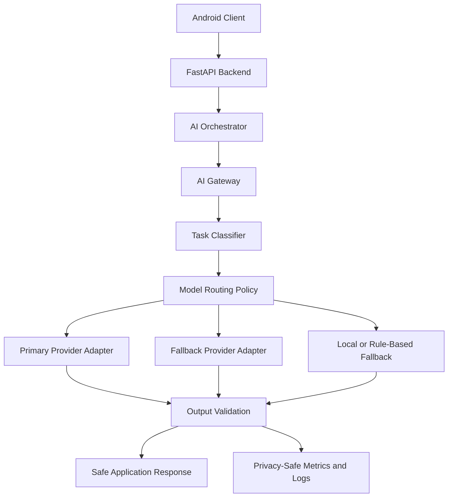
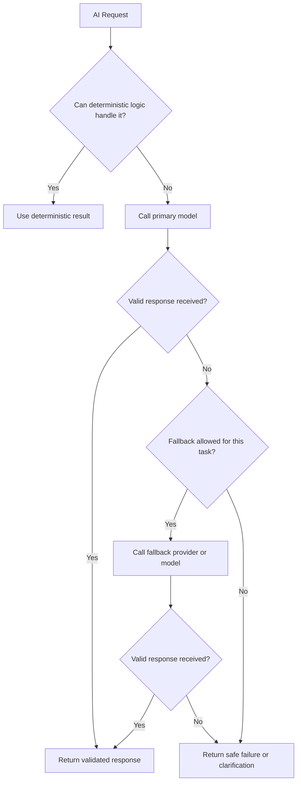

# ADR-013 — AI Model Provider Strategy, Cost Controls, and Fallback Behavior

**Status:** Accepted
**Date:** 2026-07-03
**Decision Owners:** Vishal Singh Kushwaha
**Related Documents:**

* `docs/03-decisions/ADR-002-ai-orchestration-and-agent-boundaries.md`
* `docs/03-decisions/ADR-004-data-storage-and-retrieval.md`
* `docs/03-decisions/ADR-005-authentication-authorization-and-privacy.md`
* `docs/03-decisions/ADR-009-quality-engineering-and-ci.md`
* `docs/03-decisions/ADR-010-observability-logging-monitoring-and-incident-response.md`
* `docs/03-decisions/ADR-012-data-retention-deletion-export-and-account-lifecycle.md`

---

## Context

Raghvi v2 depends on AI models for conversation, reasoning, summarization, structured extraction, memory candidate generation, task planning, and action-intent classification.

AI providers differ in capability, latency, reliability, pricing, rate limits, privacy controls, structured-output support, and available models. Building directly around one provider’s SDK would make the backend difficult to test, expensive to operate, and harder to evolve.

Raghvi must also avoid using expensive models for every request. A simple reminder extraction should not consume the same resources as a complex coding or planning request.

This ADR defines how Raghvi selects models, integrates providers, controls costs, handles failures, and keeps AI behavior safe when a provider is unavailable.

---

## Problem Statement

How should Raghvi v2 integrate AI model providers while maintaining flexibility, controlling cost, protecting user data, validating outputs, and providing safe fallback behavior?

---

## Decision

Raghvi v2 will use a **provider-agnostic AI Gateway** inside the FastAPI backend.

The AI Gateway will:

* Isolate provider-specific SDKs from the rest of the application.
* Route requests to models based on task complexity and risk.
* Support configurable primary and fallback providers.
* Enforce token, budget, timeout, and retry controls.
* Validate structured outputs before application use.
* Record privacy-safe usage and reliability metrics.
* Avoid sending unnecessary user context to providers.
* Fail safely when no reliable model response is available.

The MVP will begin with one primary provider and one optional fallback provider, but application code outside the AI Gateway must not depend on a specific model vendor.

---

## Architecture Overview



The AI Gateway is an internal module, not a public API.

---

## Core Principles

Raghvi’s AI integration must follow these principles:

* Do not lock core application logic to one AI provider.
* Use the smallest reliable model for the task.
* Use expensive reasoning only when the task justifies it.
* Never execute actions from unvalidated model output.
* Do not send secrets or unnecessary personal data to a provider.
* Treat model responses as untrusted input.
* Fail safely instead of pretending a failed response is correct.
* Make model choice observable and configurable.
* Keep provider keys isolated from application code.
* Support future model changes without rewriting product logic.

---

## AI Gateway Responsibilities

The AI Gateway will be responsible for:

* Provider authentication and SDK integration
* Model selection
* Prompt-template selection
* System-instruction injection
* Request timeout handling
* Retry handling
* Fallback routing
* Token and cost estimation
* Structured-output validation
* Response normalization
* Error normalization
* Privacy-safe telemetry
* Provider health tracking

The AI Gateway must not be responsible for:

* Database persistence
* Permission enforcement
* Device-action execution
* Final authorization decisions
* Android UI behavior
* Direct memory writes without validation by the memory module

---

## Provider Adapter Interface

Each provider must implement a common internal interface.

Example conceptual interface:

```text
generate_text(request) -> AIResponse
generate_structured(request, schema) -> StructuredAIResponse
health_check() -> ProviderHealth
estimate_cost(request) -> CostEstimate
```

A normalized AI response should include:

```text
provider
model
request_id
response_text
structured_output
usage
latency_ms
finish_reason
status
error_code
```

Provider-specific response formats must not leak into domain modules.

---

## Model Routing Strategy

Raghvi will classify AI work into tiers.

| Tier   | Use Cases                                           | Model Requirement                                           |
| ------ | --------------------------------------------------- | ----------------------------------------------------------- |
| Tier 0 | Deterministic rules, validation, formatting         | No LLM required                                             |
| Tier 1 | Simple extraction, classification, short summaries  | Fast and low-cost model                                     |
| Tier 2 | Normal conversation, planning, memory-aware answers | Balanced general-purpose model                              |
| Tier 3 | Complex reasoning, coding help, multi-step planning | Higher-capability reasoning model                           |
| Tier 4 | High-risk or uncertain requests                     | Model response plus strict validation and user confirmation |

Examples:

```text
"Remind me tomorrow at 9 AM"
→ Tier 0 or Tier 1

"Summarize my tasks for today"
→ Tier 1 or Tier 2

"Help me design a backend architecture"
→ Tier 2 or Tier 3

"Send this message to my manager"
→ Tier 2 for drafting, Tier 4 for action confirmation

"Open Spotify"
→ Tier 0 or Tier 1 intent classification, then deterministic action handling
```

The system should prefer deterministic logic whenever it can reliably solve the task.

---

## Primary Provider Strategy

The MVP will use one primary provider selected for:

* Strong general reasoning
* Reliable structured output
* Suitable API availability
* Reasonable latency
* Affordable development usage
* Clear account and billing controls
* Stable documentation
* Appropriate privacy terms

The provider selection must remain configurable through environment variables.

Example configuration:

```text
AI_PRIMARY_PROVIDER=provider_name
AI_PRIMARY_MODEL=default_model_name
AI_FALLBACK_PROVIDER=provider_name
AI_FALLBACK_MODEL=fallback_model_name
```

The implementation must not hardcode provider names throughout the application.

---

## Fallback Strategy

Fallbacks should be deliberate, not automatic for every failure.



Fallback may be used when:

* The primary provider times out.
* The primary provider has a temporary outage.
* The primary response fails schema validation.
* The primary provider rate limit is reached.
* A configured model is unavailable.

Fallback should not be used when:

* The request contains data that the user has not consented to share with another provider.
* The task is high-risk and requires explicit user confirmation before continuing.
* The fallback provider does not meet the required capability or privacy policy.
* The request has already exceeded its retry or cost budget.

---

## Safe Failure Behavior

When Raghvi cannot obtain a reliable answer, it must be transparent.

Examples of safe behavior:

* Ask the user to retry later.
* Ask a clarification question.
* Offer a reduced capability response.
* Use deterministic information already available.
* Save the request only when user expectations and privacy settings allow it.
* Avoid inventing an answer.
* Never claim an action was completed when execution failed.

Example user-facing behavior:

```text
I could not reliably complete that request right now. I have not sent anything or changed anything. Please try again in a moment.
```

For action-related requests, Raghvi must always state whether the action was proposed, awaiting confirmation, completed, cancelled, or failed.

---

## Structured Output Validation

LLM-generated structured output must be validated before use.

Example flow:

```text
Model returns JSON
→ parse JSON
→ validate with Pydantic schema
→ validate business rules
→ validate permissions and confirmation requirements
→ create action proposal or domain command
```

If any validation step fails:

```text
Reject output
→ optionally retry with stricter instructions
→ use fallback if permitted
→ return safe failure or clarification
```

The backend must never execute a device action, send a message, create a reminder, or save a memory solely because a model returned plausible text.

---

## Prompt and Context Management

Prompts should be assembled from controlled layers:

```text
System instructions
→ safety and privacy rules
→ product behavior rules
→ user-approved memory context
→ current conversation context
→ task-specific instructions
→ output schema requirements
```

Rules:

* Do not include all user memory by default.
* Retrieve only relevant memory.
* Limit conversation history to the context needed for the task.
* Exclude deleted, expired, low-confidence, or unauthorized memories.
* Do not include passwords, tokens, OTPs, or secrets.
* Keep prompts versioned where practical.
* Record prompt version identifiers in privacy-safe telemetry.

---

## Cost Controls

AI cost must be controlled from the MVP stage.

### Per-Request Controls

* Maximum input token budget
* Maximum output token budget
* Timeout limit
* Retry limit
* Task-specific model selection
* Context trimming
* Retrieval-result limits
* Structured-output limits

### Per-User Controls

Future versions may support:

* Daily request limits
* Daily token budgets
* Premium usage tiers
* Higher reasoning limits for approved users
* User-visible usage controls

### Global Controls

* Monthly provider budget alerts
* Model-level cost tracking
* Circuit breaker for runaway cost
* Feature flags for expensive capabilities
* Ability to disable expensive reasoning workflows
* Rate limiting for abuse prevention

---

## Cost-Aware Routing

The routing policy should consider:

* Task type
* Task complexity
* User intent
* Required response quality
* Latency sensitivity
* Current provider health
* Remaining budget
* Privacy constraints
* Whether a deterministic solution exists

Example policy:

```text
Simple classification
→ low-cost model or deterministic parser

Normal chat
→ balanced general-purpose model

Complex coding or planning
→ higher-capability model

Action request
→ structured model output + policy validation + confirmation

Provider outage
→ fallback model only if policy permits
```

---

## Rate Limits and Circuit Breakers

The AI Gateway must protect the system from provider failure and unexpected cost.

Rate limiting may apply to:

* Requests per user
* Requests per IP address
* Requests per minute
* Expensive reasoning requests
* Background AI jobs
* Memory extraction jobs

Circuit breakers should activate when:

* Provider error rate exceeds a threshold.
* Provider latency becomes consistently high.
* Cost usage exceeds configured limits.
* Structured-output failure rate spikes.
* A provider returns repeated authentication or quota errors.

When a circuit breaker is active, the system should use deterministic fallbacks, secondary providers where allowed, or safe degraded behavior.

---

## Privacy and Provider Data Sharing

Before sending data to an AI provider, Raghvi must apply data minimization.

Rules:

* Send only context necessary for the task.
* Avoid sending raw contact lists, full message histories, or unrelated memories.
* Do not send secrets.
* Respect user privacy settings and future provider-sharing preferences.
* Use provider settings that minimize retention where available.
* Document which provider categories may process user data.
* Keep provider API keys separate by environment.
* Review provider terms before production use.

The product must not claim that user data is never processed by an AI provider if requests are sent to external model APIs.

---

## AI Usage Telemetry

The system should record privacy-safe AI usage data.

Recommended fields:

```text
request_id
provider
model
task_type
prompt_version
latency_ms
input_token_estimate
output_token_estimate
estimated_cost
status
fallback_used
validation_result
```

Do not log:

* Full prompts
* Full responses
* Full user messages
* Full memory content
* Secrets
* Tokens
* Private attachments

---

## Evaluation and Model Changes

Changing a model can change behavior significantly.

Before changing a production model or prompt:

1. Run the relevant evaluation dataset.
2. Compare structured-output validity.
3. Compare latency and estimated cost.
4. Review safety-sensitive scenarios.
5. Validate action-intent and memory behavior.
6. Test staging flows.
7. Roll out gradually where possible.
8. Monitor errors, fallback rate, and user-impact signals.

A model change should be treated as a product behavior change, not merely a configuration update.

---

## Provider Outage Playbook

When the primary provider is unavailable:

```text
Detect provider failure
→ confirm circuit-breaker threshold
→ stop repeated retries
→ enable approved fallback if allowed
→ reduce non-essential AI background jobs
→ show safe degraded behavior
→ monitor recovery
→ document incident if user impact is significant
```

During an outage:

* Do not execute actions based on incomplete AI results.
* Do not silently switch providers if user privacy settings prohibit it.
* Do not create duplicate background jobs.
* Keep core non-AI functions available where possible, including reminders, task viewing, and memory management.

---

## Alternatives Considered

### Option A — Directly Call One Provider from Application Modules

**Advantages**

* Fastest initial implementation
* Fewer abstractions

**Disadvantages**

* Strong vendor lock-in
* Difficult testing and mocking
* Provider-specific logic spreads through the codebase
* Harder fallback implementation
* Cost controls become inconsistent

**Decision:** Rejected.

### Option B — Build a Complex Multi-Agent, Multi-Provider Platform Immediately

**Advantages**

* Maximum flexibility
* Supports advanced experimentation

**Disadvantages**

* Too much complexity for the MVP
* Harder debugging
* Higher cost risk
* Slower feature delivery
* More failure modes

**Decision:** Rejected for the MVP.

### Option C — Provider-Agnostic AI Gateway with Controlled Routing

**Advantages**

* Keeps domain logic independent of providers
* Supports fallback behavior
* Enables cost-aware model routing
* Makes testing easier
* Provides a clean path to future providers and local models
* Keeps the MVP manageable

**Disadvantages**

* Requires an abstraction layer
* Requires ongoing evaluation when models change
* Fallback behavior needs careful privacy policy design

**Decision:** Accepted.

---

## Consequences

### Positive Consequences

* Raghvi can change providers without rewriting the product.
* Cost is controlled through routing, budgets, and limits.
* AI failures have defined safe behavior.
* Structured output becomes safer for memory and action workflows.
* Testing can mock the AI Gateway.
* Provider outages degrade gracefully rather than breaking the entire app.
* Future local or self-hosted models can be added behind the same interface.

### Negative Consequences

* The AI Gateway adds initial engineering work.
* Model evaluation must be maintained.
* Different providers may produce inconsistent responses.
* Fallbacks can increase cost if not controlled.
* Provider privacy terms require periodic review.

---

## MVP Scope

The MVP will include:

* AI Gateway module
* One primary provider adapter
* Optional fallback provider adapter
* Configurable provider and model settings
* Task-tier routing policy
* Deterministic handling for simple supported tasks
* Request timeout and retry limits
* Structured-output validation with Pydantic
* Privacy-safe AI telemetry
* Basic token and cost estimation
* Provider failure handling
* Feature flags for expensive AI capabilities

The MVP will not include:

* Automatic multi-model debate
* Fully autonomous agents
* Fine-tuning custom models
* Self-hosted production models
* Dynamic real-time bidding between providers
* Complex multi-provider data residency routing
* User-facing model selection UI
* Unlimited autonomous background reasoning

---

## Future Evolution

Future iterations may add:

* More provider adapters
* Local or self-hosted model support
* User-selectable model preferences
* Fine-grained per-feature budgets
* AI cost dashboard
* Prompt registry and automated prompt evaluation
* Semantic caching for repeated requests
* Model quality scoring
* Dynamic model routing based on live performance
* Provider-specific privacy preferences
* Offline batch processing for non-urgent tasks
* Optional user-selectable technical capability or model preference for eligible complex tasks such as engineering, coding, research, and advanced analysis


---

## Future User Model Selection Policy

Raghvi v2 may allow users to select an AI model in the future, but only for eligible complex and professional tasks.

Model selection is not a core part of Raghvi’s normal conversational experience. For everyday communication, emotional support, reminders, planning, casual questions, and personal assistance, the user should interact only with Raghvi.

The user should feel that they are speaking with one consistent assistant, not switching between different AI products or model providers.

### Default Conversation Experience

For normal conversations, Raghvi will automatically choose the appropriate model through the AI Gateway.

The user will not need to know:

* Which provider is being used
* Which model generated the response
* Whether a fallback model was used
* How internal routing decisions were made

Raghvi remains the single visible identity and personality.

```text
User talks to Raghvi
→ Raghvi selects the right internal capability
→ Raghvi responds in a consistent personality and tone
```

The system must preserve consistency in:

* Personality
* Tone
* Memory usage
* Safety behavior
* Privacy behavior
* Communication style
* Action-confirmation rules

A provider or model change must never make the user feel that they are suddenly talking to a different assistant.

### Eligible Model Selection Tasks

Model selection may be offered for tasks where users explicitly benefit from different technical capabilities.

Examples include:

* Software engineering
* Code generation
* Code review
* Debugging
* Architecture design
* Complex research
* Long-form technical writing
* Data analysis
* Advanced planning
* Document analysis
* High-complexity reasoning tasks

Example future user experience:

```text
User: Help me design a scalable backend architecture.

Raghvi: I can handle this using my standard engineering capability,
or you can choose a preferred model for this technical task.
```

The feature should be presented as selecting a **technical capability** or **engineering mode**, rather than forcing users to understand provider-specific model differences.

### Model Selection Constraints

Even when a user selects a model for an eligible task:

* Raghvi remains the visible assistant identity.
* The selected model is used only for the relevant task or session scope.
* User memory, permissions, and action policies remain controlled by Raghvi.
* Model output must still pass validation and safety checks.
* Device actions must still require the normal confirmation workflow.
* The selected model must not receive more user data than necessary.
* The system may reject a model selection if privacy, availability, cost, or capability policy does not allow it.
* The system must clearly communicate if the requested capability is temporarily unavailable.

### Product Principle

```text
Raghvi is the relationship.
Models are internal capabilities.

Users may choose specialized capabilities for complex work,
but they should never need to manage Raghvi’s identity.
```

This approach keeps the product personal and human-centered while still giving advanced users useful control for demanding technical tasks.


## Decision Gate

This ADR is accepted when the project agrees that:

* AI providers are accessed only through the AI Gateway.
* Model selection is task-aware and cost-aware.
* Structured AI output is validated before use.
* Actions and memory writes remain governed by deterministic policy checks.
* Provider outages have safe fallback behavior.
* AI usage is measured without logging private content.
* Provider choice remains configurable and replaceable.

---

## Interview Talking Points

* Why use an AI Gateway instead of calling an LLM SDK directly?
* How do you control AI cost in a consumer assistant?
* How do you safely use LLM output for reminders or device actions?
* What happens if the primary model provider is unavailable?
* How do you prevent unnecessary user data from being sent to a provider?
* Why should model changes be evaluated like product changes?
* How do deterministic rules and LLMs work together in this architecture?
